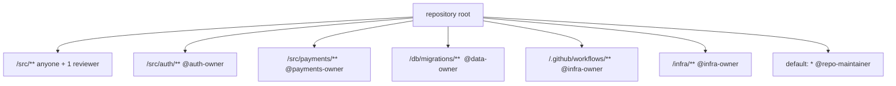

> **Section 13 · Lesson 5** · Level: intermediate · ~12 min · Prereq: [Code review for AI code](13-Code-Review-For-AI-Code)

## Why this matters

Ownership answers two questions that otherwise get resolved after an incident: *who reviews this?* and *who is accountable if it breaks?* A `CODEOWNERS` file is a routing table — a list of paths and the people who must approve changes to them. It is the cheapest piece of governance you can add to a repository, and it makes the review requirement on your riskiest paths automatic instead of a thing you remember to ask for.

## Ownership as a routing table

Most of a repository can be reviewed by anyone. A small number of paths cannot. Those paths deserve owners:

- **Authentication and authorisation** — the code that decides who may do what.
- **Money** — payment, payout, balance and ledger code.
- **Migrations and schema** — anything that mutates a production database.
- **CI workflow files and secrets** — the pipeline that has credentials.
- **Infrastructure** — deployment configuration, environment definitions, IaC.

A `CODEOWNERS` file expresses exactly that. It lives at `.github/CODEOWNERS` (or the repository root) and the last matching pattern wins:

```
# .github/CODEOWNERS
*                         @repo-maintainer

/src/auth/**              @auth-owner
/src/payments/**          @payments-owner @repo-maintainer
/db/migrations/**         @data-owner
/.github/workflows/**     @infra-owner
/infra/**                 @infra-owner
```

The first line matters most: a default owner means nothing merges unsupervised. Create the file, then switch on the setting that makes it binding — "Require review from Code Owners" in branch protection — or it is a suggestion, and suggestions do not survive a busy week.



Handles here are placeholders. Use team handles rather than one person's account where you can: a team survives a holiday.

## Review requirements per path, and who may promote

Ownership is not the same as approval authority for every action. Define the levels:

- **Normal paths** — one human reviewer, CI green.
- **Owned paths** — the owner's approval is required, and the owner is accountable.
- **Production promotion** — an environment with a required reviewer, so the deploy job cannot read production secrets until a human approves it. One named person approves a promotion, not a crowd.
- **Never merged automatically** — migrations, workflow changes, secret and auth code.

The environment gate is what makes "who may promote" concrete: if a workflow job needs production credentials, GitHub will not hand them over until the required reviewer approves. Approval becomes a technical condition, not a convention.

## CI configuration and secrets deserve the strictest ownership

Workflow files are the most privileged files in the repository. Two facts from the GitHub Actions secure-use guidance explain why:

- **Anyone with write access to the repository can read every secret configured in it.** Secrets are protected from outside contributors, not from your own collaborators — which is another reason the permission model matters, and another reason to keep workflow access narrow.
- **A compromised action in a workflow can reach every secret** available to that job, and can write to the repository with `GITHUB_TOKEN`. Pin third-party actions to a full-length commit SHA and set the token's default permissions to read-only, raising them per job only where needed.

Add to that list: workflow triggers that run privileged code from an untrusted pull request (`pull_request_target`, `workflow_run` with a fork checkout) are a known repository-takeover pattern. Someone who owns `.github/workflows/**` can grant themselves access to everything, so that path gets the strictest owner and the fewest approvers.

## Bus factor

The bus factor is the number of people who can be hit by a bus before the project stops. If it is one, you are one person's calendar away from an unmaintainable system. Keep a short list — the two or three things only one person can do — and treat each as an issue with an owner and a deadline:

- The deploy and rollback procedure, including where the credentials live.
- The migration runner and what to do when a migration half-applies.
- The provider billing console, API keys and spend limits.
- The domain, DNS and certificate renewal.

The fix is not documentation alone: have someone else run the procedure once, on a quiet day, while you watch. A second person who has done it once beats a page nobody has followed.

## Ownership and agents

An agent cannot be the owner of anything. It has no accountability, it is not on call, and it does not answer questions. When you ask an agent to implement a feature in an owned path, the owner remains *you* — the name on the commit and the person who answers for it. So:

- The agent's diff in an owned path gets the same review as a colleague's, with the owner approving.
- Attribution matters. If a change was generated, say so in the PR, and include the evidence: the command, the test output, the screenshot.
- Rules files are not a substitute for ownership. Telling an agent "never touch `migrations/`" is advisory; a `CODEOWNERS` entry plus a required review is not.

## Try it

1. Create `.github/CODEOWNERS` with a default owner on `*` and specific owners for `src/auth/`, `db/migrations/`, `.github/workflows/` and your infra directory.
2. Enable "Require review from Code Owners" in the branch protection rules for your default branch.
3. Open a throwaway PR touching only `.github/workflows/`, and confirm it cannot merge without the owner. Screenshot the blocked button.
4. Create an environment called `production` with a required reviewer, and check that the job needing it waits for approval.
5. Write your bus-factor list — three items, maximum — and put a name and a date on each.
6. Ask an agent to make a trivial change inside an owned path and confirm the ownership rule fires.

## Common mistakes

- **A `CODEOWNERS` file with no enforcement** — it reads like policy and behaves like a comment. Turn on required code-owner review.
- **Individual accounts on every path** — people move teams and leave. Use a team handle with at least two members.
- **Owners on everything** — every PR then waits on the same busy person and review latency doubles. Own the risky few.
- **Treating a workflow edit as a normal change** — it can reach every secret in the repository. Read those line by line.
- **Assuming secrets are safe from your collaborators** — anyone with write access can read them. Grant write access deliberately.
- **A bus-factor list in one person's head** — if the rollback procedure has never been run by someone else, you have a risk, not a list.
- **Letting an agent's diff skip review because "the tests pass"** — the owner is still accountable, and ownership is not transferable to a model.

## Key takeaways

- Ownership is a routing table: a default owner on `*` plus strict owners on auth, payments, migrations, workflows and infra.
- A rule that is not enforced is a comment — enable required code-owner review.
- Production promotion goes through a protected environment with a named required reviewer.
- Workflow files and secrets are the most privileged paths in the repo; pin third-party actions to a commit SHA and keep the default token read-only.
- Keep the bus factor above one for the deploy, migration, billing and DNS procedures, and prove it by having someone else run them.
- The owner is accountable for what an agent shipped under their name; attribution and evidence stay in the PR.

## Further learning

- [Secure use reference for GitHub Actions](https://docs.github.com/en/actions/reference/security/secure-use) — secrets, token permissions, untrusted checkout and third-party actions.
- [Policies for blocking and SHA-pinning actions](https://github.blog/changelog/2025-08-15-github-actions-policy-now-supports-blocking-and-sha-pinning-actions/) — enforcing pinned actions at repository or organisation level.
- [GitHub Docs](https://docs.github.com/) — CODEOWNERS syntax, branch protection and environment reviewers.
- [Branch protection and required checks](05-Branch-Protection-And-Required-Checks) — the settings that make ownership binding.
- [Secrets in CI](05-Secrets-In-CI) — storing and scoping credentials properly.
- [Deployment pipelines](05-Deployment-Pipelines) — the gate the required reviewer protects.
