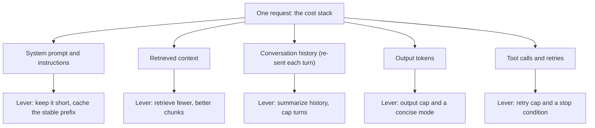

> **Section 13 · Lesson 4** · Level: intermediate · ~18 min · Prereq: [Token and cost discipline](03-Token-And-Cost-Discipline)

## Why this matters

Token discipline keeps one agent session cheap. Budgets keep a *product* alive — the difference between a feature whose cost you understand and one that quietly becomes your largest line item. It is cheap to build and easy to make expensive: the same request re-sent a dozen times, retrieval that grows with the corpus, no ceiling anywhere.

## The unit economics of one request

Four things are billed, and they multiply rather than add.

- **Input tokens.** The whole context — system prompt, retrieved documents, previous turns — is re-sent on *every* turn. A ten-turn conversation pays for turn one ten times. This is usually the largest line.
- **Output tokens.** Generated text and tool-call arguments. Cost scales with answer length.
- **Tool calls and retries.** Every search, every function call, every failed attempt is another round trip with its own input and output.
- **Retrieval.** Embedding, indexing and the vector queries, plus the tokens spent carrying retrieved chunks into the prompt.

The stack below is one request. Each layer carries the lever that shrinks it.




## Model it before you build

Three measurements turn this into a number you can defend:

- **Tokens per request** — measured, not guessed. Probe with one easy, one medium and one hard task.
- **Requests per user per month** — pick an assumption and write it down. "100 asks per user per month" is a plan; "some usage" is a hope.
- **Cache hit rate** — the fraction served without a model call. Assume conservatively; the planning figures in this section's source material used 10–30% (as of 2026).

A measured probe on a small research service put one uncached answer at a median of roughly `$0.0017` (as of 2026), and the useful finding was *what* drives it: total cost tracked answer length and retrieved-context size, not how hard the question looked.

```python
# Sketch: monthly cost before you build anything
in_price, out_price = 0.15 / 1_000_000, 0.60 / 1_000_000  # per token, as of 2026
tokens_in, tokens_out = 3_500, 2_700                      # measured per request
users, asks_per_user, cache_hit = 200, 100, 0.20           # stated assumptions
billed = users * asks_per_user * (1 - cache_hit)
print(round(billed * (tokens_in * in_price + tokens_out * out_price), 2), "USD/month")
```

Change one variable at a time. If the answer is unacceptable, you have found a design problem while it is still cheap to fix.

## The levers, in order of returns

- **Output caps.** Cheapest control on the list, and the one the measurements point at. Cap `max_tokens` and offer a concise mode. Shorter answers are also faster.
- **Context hygiene.** Do not re-send the world: summarise old turns, drop tool output you no longer need, keep the instruction prefix stable so the provider can cache it.
- **Caching.** Prompt caching reuses a stable prefix. A semantic cache answers a repeat question with no model call, and its correctness lives entirely in the similarity threshold — too loose and you serve a wrong answer at full confidence, too tight and you never hit. Measure the hit rate and spot-check the hits.
- **Domain-scoped cache keys.** A key must include the tenant, the knowledge-base version, the language and the model. A key shared across domains will eventually return another customer's context: a correctness bug and a data-leak bug in one.
- **Retrieval limits.** Cap how many chunks you fetch and how many tokens they may consume. Retrieval is a knob, not a default.
- **Model routing.** Send classification, formatting and short summaries to a small model; keep the large one for synthesis. Gate any premium mode behind a per-user quota.
- **Batching.** Work that need not be instant can go through a batch endpoint, priced at roughly half in the source material (as of 2026, provider-dependent).

## Budgets and circuit breakers

Reporting is not controlling. Four things, in this order:

1. **Per-user quotas** — a request count or credit budget per user per period, bounding one heavy user's blast radius to something you chose.
2. **Spend alerts** — a threshold that pages a human. Alerts detect; they do not prevent.
3. **Hard caps** — a ceiling the platform enforces by stopping work. Set it before you scale.
4. **A behaviour at the cap**, decided in advance: **degrade** (cheaper model, shorter answer, cache only), **queue** (accept and process later), or **refuse** (a clear message). Never the fourth option, which is the default: keep serving and silently overspend.

One cautionary pattern from the source material, generalised: a shared workspace spend cap was consumed by unrelated apps, and the provider then disabled serving for *every* app in that workspace — including one costing about a tenth of a dollar a month. Caps follow billing boundaries, not products, so give a critical service its own.

Budget the verification too: if a plan includes reviews, evaluations or a second model pass, reserve their cost before you start, and if the reserve does not fit, narrow the scope rather than dropping the checking.

## Report it, and re-measure

Report cost as a resource, like latency or error rate: cost per successful outcome, tokens per request, cache hit rate, and the share of requests hitting a limit. Cost per *successful* outcome is the number that matters — a cheap pipeline that fails a third of the time costs more than the one it replaced. Then re-measure: prices, models and cache behaviour change, and so does your code.

The sunk-cost trap closes the page: a tuned, cheap pipeline that does not solve the user's problem is not a saving.

## Try it

1. Pick one AI feature. Measure tokens in and out for one easy, one medium and one hard request.
2. Compute monthly cost per user at 10, 100 and 500 users with the sketch above.
3. Add an output cap and a concise mode, re-measure the same probes, and record the change.
4. Write your cache key down — tenant, corpus version, language, model — and check the threshold with two near-identical questions and one different one.
5. Set a hard cap, a per-user quota and an alert below the cap, then write one runbook line saying what happens at the cap.

## Common mistakes

- **Planning from "it is only a few cents"** — per-request cost is meaningless without requests per user. Multiply first.
- **A semantic cache with a loose threshold** — it returns wrong answers at full confidence while the saving looks excellent, right up to the support ticket.
- **No cache key scope** — leave out the tenant or corpus version and you get cross-customer leakage and stale answers.
- **Alerts with no cap, or a cap with no plan** — an alert nobody acts on and a cap that throws an unhandled error are both outages waiting for a reason.
- **Silently overspending** — the worst option at the cap and the default one. Pick degrade, queue or refuse, and show the message in the UI.
- **One cap shared by unrelated services** — a billing boundary is not a product boundary.
- **Optimising a feature nobody uses** — measure success, not just spend.

## Key takeaways

- Input tokens re-sent every turn plus output length are the dominant lines; retries and retrieval multiply them.
- Model cost per user before building: tokens per request, requests per user, cache hit rate.
- Cheapest wins first: output caps, context hygiene, caching, retrieval limits, model routing, batching.
- Scope every cache key by tenant, corpus version, language and model.
- Have quotas, alerts, a hard cap and a decided behaviour at the cap — degrade, queue or refuse, never overspend silently.
- Report cost per successful outcome, and re-measure when models or prices change.

## Further learning

- [OWASP Top 10 for LLM applications](https://genai.owasp.org/llm-top-10/) — unbounded consumption, the failure mode behind every runaway bill.
- [Evaluation best practices](https://developers.openai.com/api/docs/guides/evaluation-best-practices) — measuring quality and cost per successful outcome instead of vibes.
- [Effective context engineering for AI agents](https://www.anthropic.com/engineering/effective-context-engineering-for-ai-agents) — the retrieval and context levers in depth.
- [Token and cost discipline](03-Token-And-Cost-Discipline) — the per-session habits that make per-request cost small.
- [Evaluating AI features](10-Evaluating-AI-Features) — how you know the cheaper configuration is still good enough.
