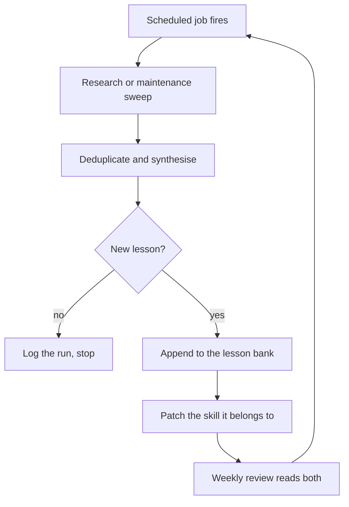

> **Section 14 · Lesson 4** · Level: advanced · ~25 min · Prereq: [Creating skills with Hermes](12-Creating-Skills-With-Hermes)

## Why this matters

Most people use an agent for one task and start over next week. The compounding version is an operator: one person running a personal agent platform for research, development and operations, where every session starts from what the last one learned. This is that practice — what accumulates, what breaks, and what to copy.

## The setup

One individual, one platform, four moving parts: a skills library (reusable procedures the agent loads on demand), a lesson bank (an append-only file of dated, one-to-five-line lessons), scheduled jobs for research and maintenance sweeps, and a memory file holding only pointers. The agent does security research, code work, and the platform's own operations.

## What compounds

**A lesson bank read before the sweep.** Entries are append-only, dated and sourced: one rule, one to five lines, no incident narration. What makes it work is *when* it is read — at the start of complex work and before every weekly sweep. A lesson written and never read is just a diary.

**Skills as reusable procedures.** Anything done twice by hand becomes a skill, so the next session does not re-derive the last one's conclusions. The operational lesson is that skills rot: a skill naming a command that no longer exists is worse than no skill, because the agent follows it confidently. [Managing a skill library](04-Managing-A-Skill-Library) covers structure.

**Memory compressed to pointers.** Memory holds critical facts and links; detail lives in files. Context is a budget, so memory should cost a few hundred tokens while the detail stays retrievable on demand.

**Jobs that report somewhere you read.** A job that runs silently is a job you will forget exists. Every run posts what it found, what changed, and what it skipped.

## Failure modes that showed up

**The bundled interpreter on `PATH` changed.** A scheduled script called a bundled interpreter by name and worked for weeks. An upgrade changed which binary that name resolved to, and the job failed nightly afterwards — silently, because nothing watched the exit code. *Never let a scheduled job depend on `PATH` resolution*: pin an absolute path and an explicit interpreter version, and report failure.

**Scanner hits needed provenance triage, not popularity.** A scanner flagged a dependency, and the circulating "evidence" was a high star count on the repository that reported it. Reading the actual source showed a hardcoded local test vector with no exploitable path. The inverse happened too: a low-visibility tool with a real finding. The rule they adopted: record every verdict **with its provenance** — source, date, commit, artefact inspected — and triage the primary evidence. Star counts measure attention, not correctness.

**Cron missed runs while a provider was down.** Jobs that should have executed simply did not, with no error to find, because the scheduler itself was unavailable. The fix was a catch-up audit: on every run, compute the runs that *should* have happened since the last one, compare them with what actually ran, and execute the difference. Any schedule you depend on needs an answer to "what happens to the runs that were skipped".

**Documentation claimed a model that did not exist.** A provider's docs listed a model as usable; a live test returned an error, because it had been disabled. *Documentation and config files do not prove availability — call the thing and read the response.*

## Orchestration lessons

**Fan-out produces volume, not signal.** Parallel sweeps return a lot of material, most of it overlapping. Without a synthesis step that deduplicates, ranks and cites, the output is a longer reading list. A sweep earns its cost only when a synthesis pass reduces it.

**Verify subagent "done" against an artefact.** A success report is a claim. Use a structured result the producer must return (a schema with the evidence fields you require) plus one bounded correction turn, then look at the artefact itself — the file, the commit, the query output. If you cannot see the artefact, you do not have the result.

**Reserve verification capacity before launching producers.** Ten researchers and no budget to check their work means ten unverifiable claims. If verification does not fit, run fewer producers and report the work as incomplete rather than thinning the evidence.

## Hygiene

- **Weekly sweeps** of skills, docs and links: does each skill name a real command, does each doc match the current system, does each link resolve.
- **Monthly pruning**: delete unused skills, retire jobs that report nothing useful, merge duplicates.
- **Every scan verdict recorded with provenance**, so the next sweep re-checks the source instead of re-litigating the conclusion.

Automate what you already do by hand, and only once you have done it enough times to know what "correct" looks like. Automating an unclear process produces wrong results faster.

## Try it

1. Create one lesson file and append a three-line entry after your next task: symptom, fix, general rule. Date it.
2. Ask an agent: *"list every scheduled job in this project and what each one does when it fails."* Any job whose failure is invisible gets a summary line that reports it.
3. Audit one scheduled script for `PATH` dependence and replace the bare interpreter name with an absolute path.
4. Pick one skill you wrote and run its commands. Patch what has changed; delete it if it is no longer true.
5. Add a catch-up check: compare the runs that should have happened since your last run against the runs that did.

## Common mistakes

- **Writing lessons nobody reads** — a lesson file that is not read at session start changes nothing. Read it before complex work and before every sweep.
- **Triaging by star count** — popularity is not evidence of exploitability in either direction. Read the source, the line, the artefact.
- **Assuming scheduled jobs ran** — a scheduler that was down produces no error at all. Compute what should have run and diff it against what did.
- **Trusting documentation for availability** — provider docs and config files are claims. Probe the thing you intend to depend on.
- **Fanning out without a synthesis step** — ten agents, ten overlapping summaries, no ranked conclusion, and a bigger bill.

## Key takeaways

- One lesson file, read before the work, formatted as one dated rule per entry.
- Turn anything done twice into a skill, sweep the library weekly, and delete what has rotted.
- Memory holds pointers; detail lives in files; context is a budget you spend deliberately.
- Every scheduled job reports somewhere you read, and knows what to do about runs it missed.
- Record every scan verdict with its provenance, and triage the primary evidence rather than the popularity of the reporter.
- Reserve verification capacity before you fan out, or you are producing unverifiable claims faster.

## Further learning

- [Agent Skills overview](https://agentskills.io/home) — what a skill is, and how agents load them on demand.
- [Equipping agents for the real world with Agent Skills](https://www.anthropic.com/engineering/equipping-agents-for-the-real-world-with-agent-skills) — design guidance for skills that survive real tasks.
- [Effective context engineering for AI agents](https://www.anthropic.com/engineering/effective-context-engineering-for-ai-agents) — why memory should hold pointers rather than detail.
- [Agentic AI: threats and mitigations](https://genai.owasp.org/resource/agentic-ai-threats-and-mitigations/) — threat classes to check before giving a scheduled agent write access.
- [Anthropic engineering blog](https://www.anthropic.com/engineering) — further write-ups on agent orchestration and verification.
