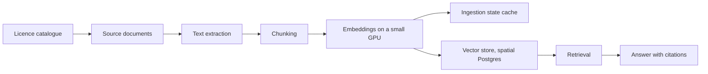

> **Section 14 · Lesson 3** · Level: advanced · ~25 min · Prereq: [Scaling from one instance](06-Scaling-From-One-Instance)

## Why this matters

Compliance tools are unusual: a wrong answer is a legal claim about someone's land, not an inconvenience. This case study is a geospatial platform that checks parcels against a deforestation regulation. The lessons are not about maps — they are about dimensions that must match, licences that must be recorded, and gates it inherited from a payments project.

## The setup

An interactive spatial intelligence app: a Python API framework on the backend, a React map frontend, spatial Postgres with a vector extension for semantic search, and document ingestion on serverless GPU compute. A user inspects parcels on a 3D map, runs a compliance check, and gets a result they may have to defend to an auditor.

## Dimension discipline

A vector column has a fixed width — 768, 1024, 1536 — and the embedding model produces a fixed width. **When the two disagree, ingestion falls over quietly**: inserts bounce, document counts stop moving, and the app keeps answering from whatever it already had. Nothing crashes, so nothing alerts. The same silence hit the map side: the platform returned four hardcoded sample features whenever the database query failed, so the demo looked alive while the data layer was broken.

The fixes are boring and total. Pin the model name and the column width together, in one place, with a comment saying they are a pair. Assert the dimension at startup and on every insert, so a mismatch is a loud error rather than a shrinking corpus. When you change models, plan a re-embedding pass — never truncate or pad vectors to fit an old column, because a truncated embedding is not a cheaper embedding, it is noise. And when a query fails, return an error or an empty state, never plausible fake rows.

## Cost-aware compute

- **The smallest GPU that fits the work.** Text embedding is not a large-model task; a small GPU with enough memory for the batch size is the whole requirement.
- **State caching so nothing is embedded twice.** Hash the source document (content hash plus model identifier) and record it. A document whose hash is already present is skipped, turning a full rebuild after a failed run into seconds of hashing instead of an hour of GPU time.
- **Batched inserts.** One row per network round trip is the classic ingestion bottleneck; a few thousand chunks at one insert each is minutes of waiting, and batching turns it into seconds.

## Data provenance and licensing

Every dataset was verified before use and recorded in a repository catalogue: source, licence, attribution, redistribution yes/no, date checked. Three rules came out of it:

- **A licence is a build dependency.** "Open" is not a licence. If the terms forbid redistribution, your downloadable evidence pack cannot contain the polygons, however good the data is.
- **Polygons are not legal boundaries.** This data documents *portions of farms* mapped by survey or remote sensing. Say so in the UI, the report and the API response, because a user will otherwise read a shape on a map as a title deed.
- **Record what you did not verify.** Datasets needing per-file review were listed separately, so "we have not checked this" was a documented state rather than a quiet assumption.

## Regulations as ground truth

Compliance answers cite the regulation and the article, not a news summary of it. Two details made that real: store page or section metadata alongside every chunk so a citation resolves to a clickable location, and keep a small curated set of regulatory sources as an authoritative tier, separate from the wider corpus. When the corpus holds both the law and commentary about the law, retrieval will happily return the commentary — the two must be distinguishable in the store, not just in the prompt.

## CI/CD, learned from the payments project

- **Migration lint in CI** — filenames follow a `NNNN_name.sql` convention, destructive statements (`DROP TABLE`, `TRUNCATE`) fail the build, and unbalanced quotes fail too. Cheap checks that catch migrations you cannot test.
- **A main-branch guard as a detective control.** Where branch protection was unavailable on the plan in use, a workflow resolved each push against the pull-request API, filed a `process-violation` issue when a commit arrived without review, and failed the run. It is detective, not preventive — the commit is already on main — but it makes the violation visible. [Branch protection and required checks](05-Branch-Protection-And-Required-Checks) covers the preventive version.
- **Pull-request gates** for conventional commit titles and secret scanning, matching the payments project.
- **A deliberate manual promotion.** CI minutes were a real line item: roughly half an hour of billable runner time per deployment cycle (GitHub bills Linux runners per minute, as of 2026), against a handful of deployments a month, while automated jobs kept failing on registry issues. Manual promotion with a written checklist was cheaper and more reliable, and the trade-off was recorded with its reasoning — which makes it a decision rather than debt. Revisit it when deployment frequency changes.

## Try it

1. Find every embedding call and its column width, and put the model name and width on one line, tied by a comment.
2. Add an assertion comparing the vector length at insert time to the column width, and make it raise.
3. Hash one document plus model identifier into a `content_hash` column, skip documents whose hash exists, and measure the time saved.
4. Write a `DATA-SOURCES.md` with one row per dataset: source, licence, date checked, attribution, redistribution allowed.
5. Ask an agent: *"find every place this project returns fallback or sample data when a query fails. Show the code and the condition."* Decide for each whether it should error instead.

## Common mistakes

- **Mixing embedding models across one column** — the write fails quietly, the corpus stops growing, and answers come from stale documents. Assert the dimension and version the model next to the column.
- **Truncating vectors to fit an old column** — a shortened embedding has no relationship to the model's geometry. Re-embed instead.
- **Fabricated fallback data** — hardcoded sample rows make a broken integration look healthy. Fail loudly, or return an explicit empty state.
- **Re-embedding documents that have not changed** — the most common wasted GPU spend in a document pipeline. Cache on content hash.
- **Treating "open data" as one licence** — open-access, academic-use and CC-BY datasets have different redistribution rules. Record which is which before shipping a downloadable pack.
- **Citing a summary instead of the source** — retrieval returns the blog post about the regulation if it outranks the regulation. Keep authoritative sources in their own tier.

## Key takeaways

- An embedding model and its vector column are one unit; a mismatch breaks ingestion silently.
- Skip unchanged documents, batch your inserts, and use the smallest GPU that fits the job.
- Track licences per dataset, including what you may redistribute and what you could not verify.
- Cite regulation and article, store the page metadata, and keep commentary out of the authoritative tier.
- Copy your gates from a project that already paid for them, and treat a manual promotion as a costed choice rather than debt.

## Further learning

- [Neon docs](https://neon.com/docs/introduction) — branching and serverless Postgres for a separate schema per environment.
- [GitHub Actions documentation](https://docs.github.com/en/actions) — the pull-request gates and branch-guard workflow above.
- [Railway CLI: deploying](https://docs.railway.com/cli/deploying) — the manual deploy path used while promotion was paused.
- [Evaluation best practices](https://developers.openai.com/api/docs/guides/evaluation-best-practices) — scoring retrieval when a wrong answer has legal weight.
- [OWASP Top 10 for LLM applications](https://genai.owasp.org/llm-top-10/) — retrieval poisoning and data-handling risks before ingesting outside documents.
