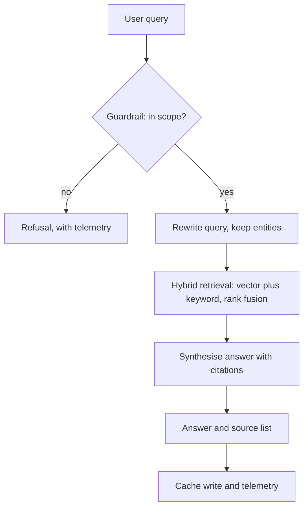
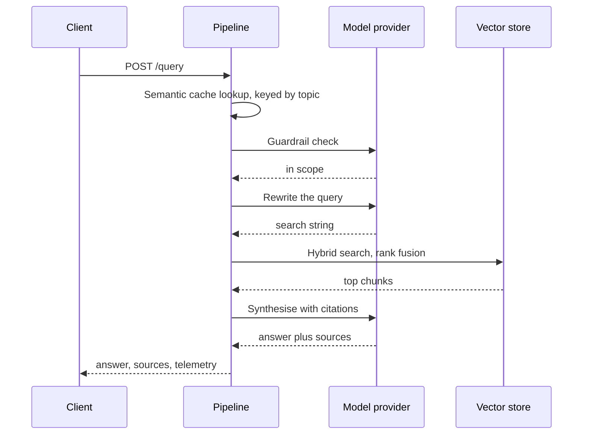

> **Section 14 · Lesson 2** · Level: advanced · ~25 min · Prereq: [Evaluating AI features](10-Evaluating-AI-Features)

## Why this matters

A research assistant is judged by whether a reader can click through to the source of every claim. One weak retrieval stage turns an answer into a plausible, uncited guess. This case study covers a multi-agent RAG assistant (RAG means the model answers from documents you supplied, not from its weights), the decisions that made it trustworthy, and the outage that taught its operator that budgets are infrastructure.

## The setup

A research assistant over a domain corpus — forestry and land-use literature — answering with strict inline citations. Four stages run per query: a guardrail that decides whether the question is in scope, a rewriter that improves the search string, hybrid retrieval, and a synthesis step that writes the answer and returns its sources. A small cheap model handles the guardrail, a mid-size model rewriting and synthesis, a small judge model scoring.

## Four decisions worth copying

**Screen before you spend.** The guardrail runs before retrieval and synthesis, on the cheapest model available, rejecting spam and out-of-scope questions while staying permissive about adjacent science. Skip it and every confused query pays full synthesis cost.

**Hybrid retrieval, not vectors alone.** Vector search is bad at exact tokens — a place name, an acronym, a DOI, a number. Combining cosine similarity with Postgres full-text search and fusing the ranked lists (rank fusion merges by rank, not score, so incomparable scales do not fight) recovered exactly the queries vectors missed. The rewriter preserves entities verbatim for the same reason.

**Cache on a topic key, not similarity alone.** A semantic cache matches new questions to stored answers by embedding similarity. On similarity alone, an answer about pest management gets served for a question about fire policy. This system required a matching topic label *and* high similarity, and stored the embedding of the **raw user query**, never the rewritten one — the rewrite is tuned for retrieval, so it drifts from what the user asked.

**Cache nothing inside a conversation.** Multi-turn sessions bypass the cache, because the same question means something different after three turns of context.

## Evaluation as a subsystem

Roughly 5% of live traffic was sampled and scored asynchronously by a small judge model on three metrics: faithfulness (is the answer supported by the retrieved chunks), answer relevance, and context precision (were the retrieved chunks on topic). The runs persist, so a retrieval regression shows up as a line going down rather than a user complaint. Canary questions — known-answer probes written to catch hallucinations — run on demand from the admin panel. [Evaluating AI features](10-Evaluating-AI-Features) covers metric choice; the case-specific lesson is that evaluation runs and production traffic share one schema, so you can compare them.

## Measured cost, not guessed cost

They probed the running system with easy, medium and hard questions and read the exact tokens and dollars from telemetry. The median landed near a fifth of a cent per uncached query (as of 2026, at the prices recorded then); cache hits were effectively free. The surprise was which lever moved the bill: **answer length and retrieved context size**, not how difficult the question looked. The "medium" question produced the longest answer and cost the most; the one-sentence answer was cheapest and fastest. That became the cheapest control available — a concise mode and an output token cap.

Three things made the numbers trustworthy: per-stage timings logged per query, per-user cost telemetry that named who was spending, and a provider price table in code, updated deliberately because a stale constant silently corrupts every cost report.

## Rollback plans, and one budget outage

Before migrating the backend off an expensive GPU host onto a cheaper API-only deployment, they wrote a rollback plan per layer: point the frontend back at the old backend (instant), restore the pre-migration source tree from a tag or tarball, or redeploy the previous platform build. All three stayed documented after the migration succeeded.

The outage came from somewhere nobody was watching. A monthly spend limit on the hosting workspace was consumed by *other* applications sharing it, and the provider disabled serving for **every** app in that workspace, including one costing about ten cents a month. The frontend reported `Failed to fetch`; the real cause, a 404 saying the workspace was disabled, was hidden behind a missing CORS header on the preflight request. Two rules came out of it: **budget alerts are infrastructure**, and **a per-app budget is not isolation**.

One more note from that migration: hybrid retrieval exceeded the database's statement timeout because its vector and text indexes were missing, so the system quietly fell back to vector-only retrieval and kept answering. Answers looked fine; hybrid quality was unavailable. Silent degradation is a bug you find by measuring, not by reading logs, so they now log which retrieval path served each query.

## Try it

1. Write down your stages and mark where a model call costs money. Find the cheapest stage that can reject work before the expensive ones.
2. Take ten real questions; if two need exact-token matching, you need keyword search alongside vectors.
3. Ask an agent: *"list every place this code decides how many tokens to send and how many to generate. Do not change anything."* Then cap the output length.
4. Log input tokens, output tokens and latency per request. After twenty requests you can state what a query costs from measurement.
5. Find your provider's spend limit and turn the alert on. Check whether it applies per app or to a shared workspace.

## Common mistakes

- **Serving a cache hit across topics** — an answer from one domain arrives for another because only similarity was checked. Add the topic to the cache key and raise the threshold.
- **Caching the rewritten query's embedding** — retrieval-tuned rewrites drift from the user's meaning. Embed the raw query.
- **Routing every stage to your largest model** — the guardrail classifies; it does not write prose. A small model answers "in scope?" for a fraction of the cost.
- **Optimising before measuring** — swapping models on intuition often raises the bill, because the driver is answer length. Probe first, then cap output.
- **Treating a shared workspace limit as someone else's problem** — one unrelated app's spike can disable everything you run there. Separate workspaces, or a budget you control.
- **Letting a degraded path fail silently** — vector-only retrieval kept answering, which is why nobody noticed. Count and alert on which path served each query.

## Key takeaways

- Put the scope check before the token spend: cheap filters protect expensive stages.
- Fuse vector and keyword retrieval when questions contain names, numbers or acronyms.
- A semantic cache needs a domain key, the raw query embedding, and a bypass for multi-turn sessions.
- Sample live traffic, score it with a judge model, and store the runs so trends are visible.
- Measure cost per query before optimising, then control the lever that measured highest — usually answer length.
- Budget alerts are infrastructure, and a workspace-level spend limit is a shared blast radius.

## Further learning

- [Building effective agents](https://www.anthropic.com/engineering/building-effective-agents) — when a pipeline of stages beats one large prompt.
- [Effective context engineering for AI agents](https://www.anthropic.com/engineering/effective-context-engineering-for-ai-agents) — deciding what enters the prompt on every call.
- [Evaluation best practices](https://developers.openai.com/api/docs/guides/evaluation-best-practices) — building eval sets, scoring, and iterating on measurements.
- [OWASP Top 10 for LLM applications](https://genai.owasp.org/llm-top-10/) — the failure catalogue that includes prompt injection and information disclosure.
- [Railway documentation](https://docs.railway.com/) — services, variables, deployment history and rollback on the platform used here.
