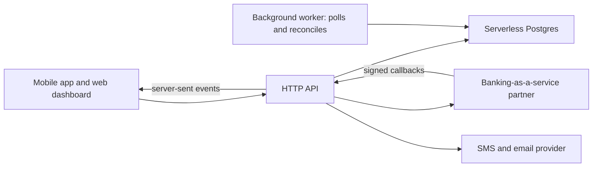
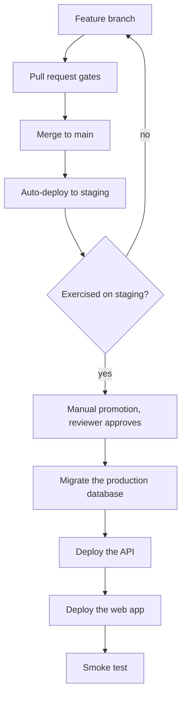

> **Section 14 · Lesson 1** · Level: advanced · ~25 min · Prereq: [Environments and promotion](07-Environments-And-Promotion)

## Why this matters

Every practice in this wiki was learned somewhere, at a cost. This section is the receipts: four real projects, anonymised, with the setup, what worked, and the mistakes that actually happened. The first is a Kenyan payments platform — the hard case, because the failure mode is somebody's money.

## The setup

A mobile and web fintech product for merchants: one app, one dashboard, one language shared across app, API and models, all in a monorepo, moving money through a banking-as-a-service partner and mobile money rails. Two decisions set the tone on day one. Production deploys were gated behind a manual promotion, and staging ran against its own branch of serverless Postgres (branching gives you a separate copy of schema *and* data on its own compute — see [Neon's docs](https://neon.com/docs/introduction)).

The pipeline above is the part worth copying.

## What worked

**Staging first, never production from a branch.** Merging to main deployed staging automatically; production moved only through an explicit, human-approved dispatch.

**One local gate script that mirrored CI.** Every pull-request check existed as a single local command, so "green locally" meant "green on the PR". Two of them earned their place: a secret scanner over the commits a branch introduces, and a conventional-commit check on the PR title.

**Decisions and docs per feature.** Significant calls became short [architecture decision records](06-Architecture-Decision-Records) and every feature shipped with a doc update. The payoff came weeks later, when a rule like "never attach a git source to the production service" was already written down with its reason and date.

**Migrations that were safe to re-run.** Every migration used `IF NOT EXISTS` guards and no destructive statements, so running the migrate tool twice was boring — which is what you want from the step that touches production during a promotion.

## What bit them

**The wire contract drifted.** The API serialised rows as snake_case; the app's models read camelCase. Nothing crashed: the client caught the deserialisation error and rendered its empty state, so a merchant saw "no wallet yet" while the API returned the wallet. *Verify the contract against a live response before debugging the screen* — one `curl` against staging settled an afternoon of guessing.

**SQL placeholders silently mis-bound values.** The helper numbered placeholders by their position in the SQL text, so `WHERE a = $1 OR b = $1` became two parameters and a value passed once failed to bind. Worse, an `UPDATE` whose `WHERE` clause appeared *after* the `SET` values bound a later parameter, matched zero rows, and still reported success. *Keep placeholders in the same order as the values array, and make the helper throw on a count mismatch.*

**A callback replied success while doing nothing.** The upstream required the literal body `ok`, so the route returned it — and exceptions in the handler were swallowed. The event row recorded `processed=true` while the account row never changed. *A success reply is a claim, not evidence.* Make swallowed errors loud, and keep a status column you can query when the numbers look wrong.

**TLS worked locally and failed in the container.** The runtime image was a slim base with no certificate bundle, so outbound HTTPS calls died on verification — while the same code passed on the laptop, whose toolchain ships its own root store. *Test the deployed artefact, not your machine.* A ten-line probe compiled the way the image compiles it tells the two apart.

**In-memory state broke with a second instance.** Real-time updates used an in-process publish/subscribe bus; bank codes sat in a static cache. Both are correct with one replica and quietly wrong with two: an event published on instance A never reaches a client on instance B. *Know where your state lives before you scale*, and pick the swap (Postgres `LISTEN/NOTIFY` or Redis) while the call sites stay identical.

**A production service auto-deployed from git and outran the gate.** The production API still had a repository trigger, so every merge redeployed it before the gated migration and the web promotion. Three production layers ended up on different commits, the API ahead of its own schema. *One deploy path per layer* — [Railway's CLI docs](https://docs.railway.com/cli/deploying) show the path that stays.

## The retrospective format worth stealing

Their write-ups were framed as "how we would have gotten here faster", ordered by time lost rather than blame: the symptom, the diff that fixed it, and the gate that would have caught it. That framing is why the list above is reusable — see [Lesson banks and retros](11-Lesson-Banks-And-Retros).

## Money raises the bar

Idempotency keys must be immutable: releasing a claim because an upstream call timed out can execute the same transfer twice, and a reused key with a different body must be rejected rather than re-executed. Every signature you compute must also be *enforced*, on inbound callbacks and on responses you trust. Reconciliation needs three legs, not two — your records, the partner's, and the settlement files — because two cannot detect a partner error. Audit logging, PII retention limits and incident-reporting windows are launch requirements. [Privacy and compliance basics](09-Privacy-And-Compliance) covers the shape.

## Try it

1. Open your CI workflow and list every check it runs. Find the local equivalent of each, and note the ones you cannot run locally — that is your next hour of work.
2. Ask an agent: *"list every place this service is configured to deploy, including platform dashboards and git integrations. Do not change anything."* You are looking for two paths for one artefact.
3. Grep for swallowed errors (`catch {}`, `except: pass`) and decide, for each hit, whether the caller then reports success.
4. Add one line to your lesson file: the symptom, the fix, and the gate that would have caught it.

## Common mistakes

- **Treating a 200 as proof of work** — the handler returned the body the upstream demanded while the database wrote nothing. Assert on the effect, not the reply.
- **Debugging the client before the contract** — an empty screen is usually a naming mismatch. `curl` the live endpoint and read the raw keys first.
- **Two deploy paths for one service** — a platform git integration redeploys your API ahead of the migration its schema needs. Keep exactly one path.
- **Testing TLS on your laptop** — the local toolchain carries its own trust store, so a passing check proves nothing about the container. Probe from inside the built image.
- **Scaling without auditing in-memory state** — in-process caches and event buses are invisible until they are wrong. Run two instances in staging once, on purpose.

## Key takeaways

- Gate production behind a manual promotion, and keep staging isolated down to the database, not just the app.
- Field names, placeholders, dimensions and env vars are all contracts: verify them against the live system, never from memory.
- A swallowed exception plus a success reply is the most expensive bug shape in this list. Assert on effects.
- Test the artefact you deploy. Local success is evidence about your laptop.
- One deploy path per layer. Where money moves, idempotency, enforced signatures, three-way reconciliation and audit logging stop being optional.
- Probe the upstream API before you build around it: a documented endpoint name is not necessarily the one that works.

## Further learning

- [Neon docs](https://neon.com/docs/introduction) — branching, serverless Postgres, and how a branch-per-environment database works.
- [Railway CLI: deploying](https://docs.railway.com/cli/deploying) — the deploy path used inside a pipeline instead of a git trigger.
- [GitHub Actions documentation](https://docs.github.com/en/actions) — workflows, environment protection rules and manual dispatch.
- [Secure use reference](https://docs.github.com/en/actions/reference/security/secure-use) — what to lock down in your workflows, including secret scanning.
