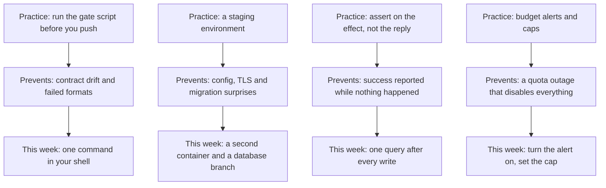

> **Section 14 · Lesson 5** · Level: intermediate · ~20 min · Prereq: [Case study: payments platform](14-Case-Study-Payments-Platform)

## Why this matters

Four projects, four domains, one overlapping set of failures. [The payments platform](14-Case-Study-Payments-Platform), [the RAG assistant](14-Case-Study-Multi-Agent-RAG), [the geospatial platform](14-Case-Study-Geospatial-Compliance) and [the solo agent operator](14-Case-Study-Agent-Operations) made the same mistakes independently, which means the mistakes are properties of the work rather than of the people. This page collects the patterns, names the gate for each failure, and says what these case studies do *not* prove.

## The twelve patterns

Every one appeared in at least three of the four projects. None is clever; all are cheap compared to the incident they prevent.

| # | Pattern | What it buys you |
|---|---------|------------------|
| 1 | Staging before production | Somewhere for the mistake to happen that is not production |
| 2 | Migrations before the code that needs them | No window where the API outruns its schema |
| 3 | One choke point per layer | One path to change each thing, so nothing deploys twice |
| 4 | Verify the contract against the live system | Field names, dimensions and endpoints caught before users see them |
| 5 | Test the deployed artefact | Truth about the container, not about your laptop |
| 6 | Loud errors | Failures that surface instead of reading as empty states |
| 7 | Small diffs | A wrong turn costs one revert, not an afternoon |
| 8 | Documented decisions, dated | The next person inherits the reasoning, not just the rule |
| 9 | Secrets outside the repository | Nothing to rotate after a bad paste |
| 10 | Budgets with alerts | Spend surprises arrive before the outage, not after |
| 11 | Lessons written down | The same afternoon is not spent twice |
| 12 | A human on the merge button | Accountability for what reaches production |

## The eight mistakes, and the gate for each

**1. An error was swallowed and success reported.** A handler returned the body its caller wanted while the database wrote nothing; a fallback returned sample rows so a broken query looked alive. *Gate:* after every write, assert on the effect — query the row, count the rows, check the returned id.

**2. Two paths changed one artefact.** A git-connected service redeployed the API ahead of the gated migration. *Gate:* list every deploy path per service, monthly. One path per layer.

**3. Configuration that worked locally was absent when deployed.** A missing certificate bundle in a slim image; a variable baked at build time and never set. *Gate:* one smoke test against the deployed artefact — health check plus a real call outward.

**4. State lived in process memory.** An in-process event bus, a static cache: correct with one instance, wrong with two, invisible until you scale. *Gate:* run two instances in staging and exercise a feature that crosses them.

**5. Two descriptions of one contract drifted apart.** API snake_case against client camelCase, an embedding model against a vector column width, docs claiming a capability a live call rejects. *Gate:* verify against the live source — `curl` the response, print the vector length, probe the model.

**6. A silent fallback hid a broken path.** Vector-only retrieval after a timeout, sample parcels when the query failed, an empty list rendered as "nothing yet". *Gate:* log and count which path served each request, and alert when the fallback is doing the work.

**7. Budgets and quotas were an afterthought.** A shared workspace spend limit disabled every app in it, one of which cost cents. *Gate:* a budget alert you actually receive, and a spend line in the weekly review.

**8. Documentation outlived the thing it described.** A stale endpoint name, a rollback section never written, a skill naming a command that no longer exists. *Gate:* a dated weekly sweep of links, commands, docs and skills, deleting rather than annotating.

Six of the eight share one shape: **the system reported something other than what happened**.

## Scaling the same rules down and up

**A weekend project.** Staging is a second container and a second database branch, or a local run against a copy of production data. Migrations run before the code in the deploy step. Secrets are platform environment variables, never a committed file. One budget alert and one lesson file exist. That is the whole stack, and it fits in an afternoon.

**A regulated product.** The same twelve items, deeper: two environments plus a promotion gate with a named reviewer, migration lint and a branch guard in CI, signature enforcement on every inbound payload, three-way reconciliation, retention limits on personal data, and an audit log you can hand to a regulator. The depth changes; the list does not.

These are the same habits at different resolutions; start at the one you can afford today. [Scaling from one instance](06-Scaling-From-One-Instance) is the design-side companion.

## What these case studies do not prove

They are four projects that **survived long enough to write the retrospective**. Projects that died of the same mistakes are not in the sample, and neither are the ones never started. That is selection bias, and it limits the conclusion:

- The patterns are **necessary, not sufficient**. Following them will not make a product succeed; ignoring them makes failure worse than it had to be.
- The gates are **survivor evidence**: each was added after its incident, which proves the incident was expensive — not that the gate is optimal.
- Absence of a failure here is **not absence of a risk**: nobody in the sample met ransomware or a hostile insider.

## Your own case study

Write one page per finished project, in this shape. It takes twenty minutes and pays back more than any other doc.

1. **Setup** — two sentences: what it is, who uses it.
2. **What worked** — three bullets, each with *why*, not just *what*.
3. **What bit you** — one entry per incident: symptom, real cause, the diff that fixed it.
4. **The rule each one produced** — one actionable line, no blame.
5. **Numbers** — cost per month, per user or per query, and how you measured it.
6. **How we would have gotten here faster** — ordered by time lost. This framing turns a status report into something reusable.

Put it in the repository next to the code, date it, and read it before starting the next project. [Lesson banks and retros](11-Lesson-Banks-And-Retros) covers the ongoing version.

## Try it

1. Score your current project against the twelve patterns: present, partial, missing. Do not fix anything yet.
2. For each of the eight mistakes, ask *"if this happened tomorrow, would I find out?"* Every "no" is a candidate gate.
3. Implement the two cheapest gates today: assert on the effect after a write, and a smoke test against the deployed artefact.
4. Write your own case study for your last finished project using the six-point template.
5. Book a recurring weekly slot for the sweep: links, commands, docs, skills, budget.

## Common mistakes

- **Treating the list as a maturity model** — you do not need a full pipeline to keep secrets out of the repo. Adopt the cheapest item today.
- **Copying a gate without the incident** — a branch guard matters where a direct push is possible. Adopt gates for failures you can actually have.
- **Reading the case studies as a formula for success** — they are evidence about failure modes from a biased sample.
- **Adding gates faster than you can read them** — an alert nobody opens is worse than none, because it feels like coverage.
- **Writing the case study months later** — detail decays fast. Symptom, cause, fix, rule, while it is fresh.

## Key takeaways

- The twelve patterns are cheap, unoriginal, and present in every project that survived its own mistakes.
- Six of the eight recurring mistakes share one shape: the system reported something other than what happened. Assert on effects.
- Every mistake has a gate, and most gates cost one query, one assertion or one probe.
- The same rules scale from a weekend project to a regulated product; only the depth changes.
- These are survivors, so read them as evidence about failure modes, not as a recipe for success.
- Write your own case study within a week of finishing, and read it before the next project.

## Further learning

- [Case study: a payments platform](14-Case-Study-Payments-Platform) — staging-first promotion, wire contracts, swallowed errors.
- [Case study: a multi-agent RAG assistant](14-Case-Study-Multi-Agent-RAG) — evaluating AI features, measured cost, budget alerts.
- [Case study: a geospatial compliance platform](14-Case-Study-Geospatial-Compliance) — dimension discipline, data licences, inherited gates.
- [Case study: running agents as a daily practice](14-Case-Study-Agent-Operations) — lesson banks, scheduled jobs, verification capacity.
- [OWASP](https://owasp.org/) — checklists that pair well with these gates, including defence in depth.
- [GitHub Actions documentation](https://docs.github.com/en/actions) — the mechanics behind most of the gates above.
