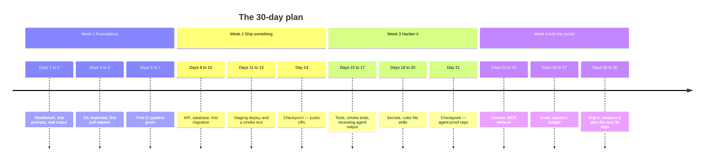

> **Section 15 · Lesson 4** · Level: beginner · ~15 min · Prereq: none

## Why this matters

A 135-lesson wiki is easy to start and easy to abandon in week two. This page is the schedule: four weeks at roughly 45 minutes a day, one deliverable every week, and a checkpoint that tells you whether you are actually learning or only reading. Do not follow it perfectly. Follow it unevenly for 30 days instead of perfectly for three.

## The plan at a glance

## Week 1 — foundations (~45 min/day)

- **Day 1:** [Set up your workbench](00-Setup-Your-Workbench), then [How to use this wiki](00-How-To-Use-This-Wiki). Run one command from each.
- **Day 2:** [How LLMs work for coders](01-How-LLMs-Work-For-Coders) and [Prompting fundamentals](02-Prompting-Fundamentals). Paste real output into your notes.
- **Day 3:** [Structuring instructions](02-Structuring-Instructions) and [Prompt patterns cookbook](02-Prompt-Patterns-Cookbook).
- **Day 4:** [Git essentials](05-Git-Essentials) and [Branching and pull requests](05-Branching-And-Pull-Requests). Branch, commit, open a PR.
- **Day 5:** [GitHub CLI quickstart](05-GitHub-CLI-Quickstart) and [Writing GitHub Actions](05-Writing-GitHub-Actions).
- **Day 6:** [Your first CI pipeline](05-Your-First-CI-Pipeline) and [Writing a great README](11-Writing-A-Great-README).
- **Day 7:** Fix whatever is red. Add the badge to the README.

*Deliverable: a public repo with a green pipeline and a README a stranger could follow.*

## Week 2 — ship something

- **Day 8:** [The feature loop](03-The-Feature-Loop) and [Plan mode and spec-driven development](03-Plan-Mode-And-Spec-Driven-Development).
- **Day 9:** [Data modeling basics](06-Data-Modeling-Basics).
- **Day 10:** [Deployment concepts](07-Deployment-Concepts) and [Deploy on Railway](07-Deploy-On-Railway).
- **Day 11:** [Postgres on Neon](07-Postgres-On-Neon). One branch per environment.
- **Day 12:** [Environments and promotion](07-Environments-And-Promotion).
- **Day 13:** [Local to cloud walkthrough](07-Local-To-Cloud-Walkthrough).
- **Day 14:** [Capstone 1](15-Capstone-1-Ship-A-Tiny-App), worked to the milestone list.

*Deliverable: your API and database on a public URL, with a merge that auto-deploys to staging and one promotion you approved.*

## Week 3 — harden it

- **Day 15:** [The test pyramid in practice](10-Test-Pyramid) and [Testing with agents](10-Testing-With-Agents).
- **Days 16–17:** [Integration and smoke tests](10-Integration-And-Smoke-Tests), [Reviewing agent output](03-Reviewing-Agent-Output), [Code review for AI code](13-Code-Review-For-AI-Code).
- **Days 18–19:** [Secrets hygiene](09-Secrets-Hygiene), [Secure code generation](09-Secure-Code-Generation), [Rules of operation: the full stack](12-Rules-Of-Operation-Overview), [AGENTS.md that actually works](12-AGENTS-md-That-Works).
- **Day 20:** [What are agent skills?](04-What-Are-Agent-Skills) and [Writing good skills](04-Writing-Good-Skills).
- **Day 21:** [Capstone 3](15-Capstone-3-Agent-Proof-Repository), including the fresh-session test.

*Deliverable: a repo with a lean `AGENTS.md`, three skills, a hook, required checks, and a logged test of all three.*

## Week 4 — add the model

- **Day 22:** [Context engineering](02-Context-Engineering).
- **Days 23–24:** [What is MCP?](08-What-Is-MCP), [Using MCP in practice](08-Using-MCP-In-Practice), then [MCP security risks](08-MCP-Security-Risks) — before you install another server.
- **Days 25–26:** [Evaluating AI features](10-Evaluating-AI-Features), [Token and cost discipline](03-Token-And-Cost-Discipline), [OWASP LLM Top 10 in plain English](09-OWASP-LLM-Top-10), [Prompt injection and exfiltration](09-Prompt-Injection-And-Exfiltration).
- **Day 27:** [Observability](06-Observability) and [Rollbacks and incidents](07-Rollbacks-And-Incidents).
- **Days 28–30:** [Capstone 2](15-Capstone-2-Add-An-AI-Feature). Record the eval score and the cost per request in the repo.

*Deliverable: a model feature behind a flag, an eval set in CI, real numbers in `docs/ai-feature-metrics.md`, and a written plan for the next 30 days.*

## Four tracks, if you are not here to ship a product

The four paths on [How to use this wiki](00-How-To-Use-This-Wiki) map onto the same 30 days. **Just shipping:** weeks 1–2 and Capstone 1; skip the evals week. **Professional engineering:** week 1 on git and CI, then branch protection, the test pyramid, ADRs on day 19 instead of skills, code review on day 17. **AI-product builder:** weeks 1 and 4, plus context engineering and MCP, and Capstone 2 instead of Capstone 3. **Team lead:** [Rules of operation](12-Rules-Of-Operation-Overview), [Writing SOPs](12-Writing-SOPs), [Issue-driven development](13-Issue-Driven-Development), [CODEOWNERS](13-Team-Ownership-CODEOWNERS), [Human accountability](09-Human-Accountability), [Managing a skill library](04-Managing-A-Skill-Library), then [Case study synthesis](14-Case-Study-Synthesis).

## Checkpoints

- **Day 7.** You can clone your repo on a clean machine and run its tests using only the README, and explain what a pull request does.
- **Day 14.** Your app is on a public URL. A merge deploys to staging automatically, and you promoted one commit yourself, with a rollback you tested.
- **Day 21.** A fresh agent session, given only the repo, can make a small change and open a passing pull request.
- **Day 30.** A model feature behind a flag, an eval score in the repo, and one number you can defend: cost per request.

## After day 30

The plan does not end, it changes gear: **one shipped change per week** (small is fine — the point is the loop), **one lesson per week** in your own `docs/lessons.md` with the command and its output, and **one skill per month** capturing a workflow you repeated three times.

## Try it

1. Copy the four weeks into your calendar as 30 blocks of 45 minutes, titled with the day's lesson.
2. Start a notes file and paste one real command output into it every day. No summaries.
3. At each checkpoint, write one sentence: what you can do now that you could not on day zero.
4. At the end of day 30, write the next 30 days yourself.

## Common mistakes

- **Reading ahead instead of shipping** — finishing week 3's reading in week 1 with nothing deployed.
- **Skipping week 3 because week 2 felt good** — you get a deployed app you are afraid to change.
- **Treating the checkpoints as optional** — they are the only evidence the month worked.
- **Not recording outputs** — "I read about migrations" and "I ran one" are different things a year later; the note with the error message is the difference.
- **Stopping at day 30** — the compounding starts at week five.

## Key takeaways

- 45 minutes a day, four weeks, one deliverable per week, four checkpoints.
- Every day ends with a run command and a recorded output.
- Pick a track on day 1 and let it reorder days 17–28; do not do all four.
- The checkpoints are tests of capability, not of reading: deploy, promote, get a stranger productive, record a number.
- After day 30: one shipped change a week, one lesson a week, one skill a month.

## Further learning

- [How to use this wiki](00-How-To-Use-This-Wiki) — the four paths this plan is built from.
- [Capstone 1](15-Capstone-1-Ship-A-Tiny-App), [Capstone 2](15-Capstone-2-Add-An-AI-Feature), [Capstone 3](15-Capstone-3-Agent-Proof-Repository) — the four deliverables, in more detail.
- [Further learning](15-Further-Learning) — courses and docs for after the 30 days.
- [Contribution exercises](04-Skill-Exercises) and [Quality exercises](10-Quality-Exercises) — the wiki's own exercise pages, if a day's lesson was too easy.
