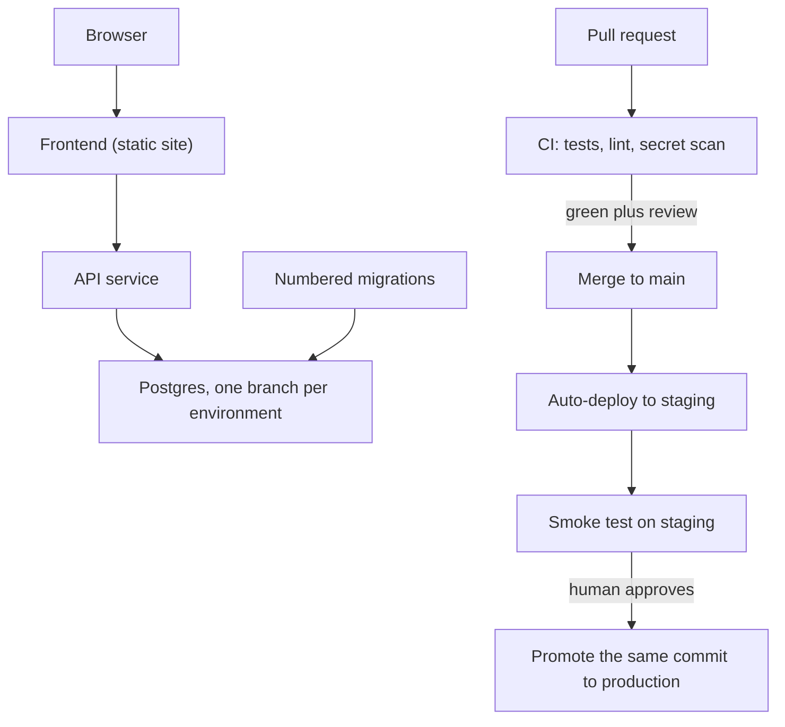

> **Section 15 · Capstone 1** · Level: beginner · ~45 min · Prereq: [Local to cloud walkthrough](07-Local-To-Cloud-Walkthrough)

## Why this matters

Every lesson so far was a rehearsal; this capstone is the performance — one small product, in public, with a pipeline that deploys it and a README a stranger can follow. Keep the app boring (one table, one form, two endpoints), because the product is not the point. The point is doing what separates "I wrote code" from "I shipped software": a database that migrates, tests that gate a merge, a staging environment, and a promotion a human approves. Expect the deploy to take three attempts.

## The target architecture

You are building this, and you should be able to redraw it from memory when you are done:

Two rules make this work. First, staging and production are separate environments with separate databases and separate secrets; a mistake in one cannot reach the other. Second, the code that reaches production is the code staging already ran — the same commit, promoted, not rebuilt.

## Milestones, each with a definition of done

Do these in order. Each ends with something a stranger can check.

1. **Repo and rules file.** A public repo with a `.gitignore`, a licence, and an `AGENTS.md`. *Done when:* a clean clone plus the commands in `AGENTS.md` gives you a running app.
2. **First endpoint and its test.** `GET /health` returning JSON, plus one test asserting status and body. *Done when:* the test goes red when you break the handler. A test that has never failed is decoration.
3. **Database and one migration.** A numbered migration file committed to the repo creates one table; the app writes and reads one row through it. *Done when:* dropping the database and re-running migrations rebuilds it, and running them twice changes nothing.
4. **CI gates.** A pull request triggers install, lint, test and a secret scan. *Done when:* a deliberately failing test blocks the merge button.
5. **Staging deploy.** A merge to `main` deploys automatically and runs a smoke test. *Done when:* a public staging URL serves the app and the smoke test hits `/health`.
6. **Promotion.** A manual workflow with a required approver deploys the same commit to production, migrating the database *before* the code that reads the new schema. *Done when:* you have promoted once, and can roll back by re-deploying the previous commit.
7. **Docs.** A README a stranger can follow, and an [ADR](06-Architecture-Decision-Records) for the hosting and database choice. *Done when:* someone else — or a fresh agent session with only the repo — gets the app running without asking you anything.

The deliverable: a public URL, a green pipeline, and a README that survives contact with a stranger.

## Using an agent, keeping the reviews

Write each milestone as an acceptance criterion before you prompt, then hand the criterion over. "Add a migration that creates a `notes` table with `id`, `body`, `created_at`; make it idempotent; add a test that inserts and reads a row; do not touch anything under `web/`." One milestone at a time, small diffs, and you read every line before it merges.

Let the agent write the boring parts: config, boilerplate, the tenth test. Do not let it own the migration order or the ADR. Those are where a plausible mistake is expensive — migrations landing after the code, or a production service quietly pointed at staging's database.

Learn the CLI paths rather than clicking. Railway: `railway link`, then `railway up --ci` with a project token instead of an interactive login in CI. Neon: `npx neon@latest init`, which links a project and writes `DATABASE_URL` into `.env`. Neon's branches are why this capstone has clean environments — one per environment, from the same starting point. Those flags are accurate as of 2026; check the docs before trusting a name.

## Try it

1. Create the repo, the `AGENTS.md`, and the seven milestones as GitHub issues.
2. Write milestone 1 as a prompt containing its acceptance criterion, review the diff, and commit it yourself.
3. Repeat for milestones 2 and 3. After each, run the suite and watch one red run on purpose.
4. Add the workflow for milestone 4 and open a pull request that fails. Confirm the merge is blocked.
5. Create two environments, deploy to staging, then break something small, deploy again, and fix it while production is untouched.
6. Promote the working commit and paste the public URL into your notes with the date.
7. Write the README last, from a clean clone, following nothing but what you wrote.

## Common mistakes

- **Building the product before the pipeline** — three days of features and no way to deploy them. Automate one deploy path on day one.
- **One environment for everything** — a "staging" that shares the production database, so your first real bug is a data bug.
- **A test that cannot fail** — `assert response is not None` on a handler you never broke. Break the code once and watch it go red.
- **Migrations after the code** — the new column is read before it exists and the first request crashes. Migrate, then deploy.
- **A README written from memory** — commands that work only in your shell, a missing variable, no mention of the port. Write it from a clean clone.

## Key takeaways

- The milestones *are* the capstone: repo, endpoint, migration, CI, staging, promotion, docs.
- A definition of done must be checkable by someone else — a URL, a blocked merge, a migration that re-runs cleanly.
- Staging and production are separate, and production receives the commit staging already proved.
- Verify the README from a clean clone; that is the stranger test.
- Keep the app boring so the pipeline is the interesting part.

## Further learning

- [Deploying with the Railway CLI](https://docs.railway.com/cli/deploying) — `up`, `--ci`, project tokens and per-environment deploys.
- [Railway quick start](https://docs.railway.com/quick-start) — the shortest path from a repository to a URL.
- [Neon documentation](https://neon.com/docs/introduction) — branches, connection strings and the `neon init` flow.
- [GitHub Actions documentation](https://docs.github.com/en/actions) — workflows, jobs and required checks.
- [Deployment pipelines](05-Deployment-Pipelines) and [Environments and promotion](07-Environments-And-Promotion) — the wiki lessons behind milestones 5 and 6.
