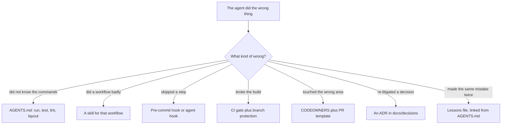

> **Section 15 · Capstone 3** · Level: intermediate · ~35 min · Prereq: [AGENTS.md that actually works](12-AGENTS-md-That-Works)

## Why this matters

A repo where you are productive and one where an agent is productive are not the same repo. Yours carries context in your head: which command runs the tests, which directory is legacy, that one route replies "ok" even when it failed. An agent has none of it, so it guesses — and its guesses are plausible enough to get merged. This capstone moves that context into files, then tests the result with a stranger.

## The rules stack: which layer covers which failure

Do not fix an agent problem with a bigger prompt. Fix it in the cheapest layer that can hold it.

The order matters. `AGENTS.md` is the cheapest thing to write and the most expensive to read, because it loads in every session: commands, layout, the conventions that are always true, and pointers to everything else. Anthropic's write-up on [Agent Skills](https://www.anthropic.com/engineering/equipping-agents-for-the-real-world-with-agent-skills) calls the rest progressive disclosure — the agent sees a skill's name and description first, and the body loads only when the task matches. A script bundled in a skill can run without entering the context window at all: cheaper and more deterministic than asking a model to re-derive a procedure.

## What to add to the repo

1. **A lean `AGENTS.md`** — install, run, test, lint, the directory map, and the local conventions ("migrations are numbered files, never edited after merge"). Under 60 lines. Anything longer belongs in a skill.
2. **Three skills for workflows you actually repeat** — add a migration, ship a release, diagnose a red CI run. Each needs a `SKILL.md` whose `description` names the trigger: that string is what the agent matches on, so write it for retrieval, not for looks. Then the steps, the commands, the failure modes, and a script wherever a script beats an instruction.
3. **Hooks and pre-commit checks** for anything that must not depend on the model remembering. Formatting, a secret scan on the staged diff, and a check that generated files were regenerated all belong here. A hook is the difference between "the agent should run the formatter" and "the commit fails if it did not".
4. **CI gates with branch protection** — the last resort. Required checks on `main`, so neither a human nor an agent can merge past a red build.
5. **PR and issue templates** — a template is a prompt the human runs on themselves. Ask for the acceptance criterion, the test that proves it, and the rollback.
6. **`CODEOWNERS`** — name the paths that need a human with context: payments, auth, migrations.
7. **An ADRs folder with one seeded decision** — start with a decision you already made and can explain, so the format is obvious. Link it from `AGENTS.md`.
8. **A lessons file** — `docs/lessons.md`, newest first, one entry per surprise: what happened, the symptom, the cause, the rule that prevents it. Link it from `AGENTS.md`.

## Then test it with fresh sessions

Configuration you have not tested is a claim. Run three tasks in fresh sessions — or hand them to another person — with no extra context: a feature needing a migration, a bug fix that requires reading a failing test, a release step.

Log the result before changing anything: which task, what went wrong, which layer should have caught it. Then re-run all three in fresh sessions and compare. Fix the layer, not the symptom.

## The deliverable

A repo where a competent stranger — a person, or a model with nothing but the repo — is productive within 30 minutes: from a clean clone they install, run the tests, and open a passing pull request using only the README, `AGENTS.md` and the skills. Time it. If it takes an hour, the missing 30 minutes is context you have not written down.

## Try it

1. Time yourself from a clean clone and log every question you answered from memory. That list is your work order.
2. Write the lean `AGENTS.md`, then delete anything you cannot justify keeping.
3. Write the three skills. Give each description that names when to use it, not what the topic is.
4. Add the hook, the CI gate and the templates. Break the rule deliberately and confirm something stops you.
5. Run the three tasks in fresh sessions and fill in the failure log before touching any file.
6. Hand the repo to someone else, or to a fresh session with a 30-minute limit, and record how far they get.

## Common mistakes

- **`AGENTS.md` as an essay** — 400 lines that load every session and get skimmed. Move procedures into skills.
- **A skill description that does not say when to use it** — the agent never triggers it, and you conclude skills do not work.
- **Rules with no enforcement** — "always run the formatter" in prose. Make it a hook; prose is a suggestion.
- **Fixing the agent instead of the repo** — a longer prompt for this session, the same failure next session.
- **A lessons file nobody reads** — unlinked from `AGENTS.md`, sorted oldest-first. Newest first, linked, appended to in the same pull request as the fix.

## Key takeaways

- Move context out of your head into files, then test the files with a fresh session.
- The cheapest layer that can hold a rule should hold it: prompt, then skill, then hook, then CI gate.
- Keep `AGENTS.md` short; put procedures in skills with retrieval-friendly descriptions.
- Enforce what must not depend on a model: hooks and required checks.
- Fix the layer that failed, re-run the same task, and compare.

## Further learning

- [Equipping agents for the real world with Agent Skills](https://www.anthropic.com/engineering/equipping-agents-for-the-real-world-with-agent-skills) — progressive disclosure and what belongs in `SKILL.md`.
- [Steering Claude Code: skills, hooks, rules and subagents](https://claude.com/blog/steering-claude-code-skills-hooks-rules-subagents-and-more) — which mechanism to reach for, and when.
- [Best practices for Claude Code](https://www.anthropic.com/engineering/claude-code-best-practices) — explore, plan, code, commit, plus hooks and headless runs.
- [AGENTS.md that actually works](12-AGENTS-md-That-Works), [Skills as operating rules](12-Skills-As-Operating-Rules) and [Lesson banks and retros](11-Lesson-Banks-And-Retros) — the lessons this capstone assembles.
