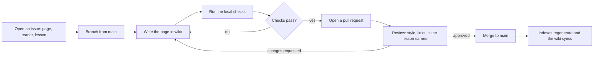

> **Section 15 · Lesson 6** · Level: beginner · ~8 min · Prereq: [How to use this wiki](00-How-To-Use-This-Wiki)

## Why this matters

You have just spent the wiki's words. The fastest way to find out whether you learned them is to add one of your own — and this is the safest pull request you will ever open. The worst outcome is a review comment, and nothing here can page anyone at 2am. If a page blocked you, that page has a bug, and you are the only person who knows where it is.

## How the repository and the wiki relate

The wiki pages are generated from markdown files under `wiki/`. Section indexes, the Home page and the sidebar come from a page manifest, so you edit one markdown file and the navigation follows. Editing through the wiki UI still produces a change that must come back as a pull request, so branch from `main` and write in the repository instead.

Internal links use the page name without `.md`: `05-Git-Essentials` works, `05-Git-Essentials.md` does not. External links come only from a verified list; if you have not seen a URL, link the documentation root and let the reader search.

## Propose a page: issue first

Open an issue before you write 900 words. State which page you want to add, who it is for, what the reader can do afterwards, and why you are the one to write it — the thing you ran, the failure you hit. A maintainer replies with a yes, a "that belongs in an existing page", or a duplicate link. Ten minutes saves an afternoon.



The page name in the manifest is authoritative: `Section NN · Lesson N`, a descriptive title, and a filename that matches it. Link the issue from the pull request and say what you changed.

## The house style, in one screen

- **No H1.** The first line is the metadata blockquote, beginning `> **Section` — section number, lesson number, level, reading time, and the prerequisite written as a wiki page name. Copy the shape from the top of any finished page.
- **Length.** 600–1000 words of prose, hard ceiling 1300. If a topic needs more, it is two pages.
- **Shape.** `## Why this matters`, two to five body sections, then `## Try it`, `## Common mistakes` (three or more specific failures), `## Key takeaways` and `## Further learning`.
- **Links.** Verified URLs only, from the section's link bank or a documentation root. A deep link you invented is a bug.
- **Secrets and private context.** Never publish keys, tokens, internal hostnames, account IDs, customer data, client names or private repository paths. Generalise the example and keep the lesson.
- **Diagrams.** Fenced `mermaid` blocks using the allowed types (`flowchart`, `sequenceDiagram`, `stateDiagram-v2`, `erDiagram`, `gantt`, `timeline`), no `%%{init}%%`, quoted labels containing punctuation, under 20 nodes.

## Every lesson must be earned

Write from experience. If you cannot show the command and its output, it is not a lesson yet — it is a plan. A model's summary of a topic nobody attempted is exactly what this wiki exists to filter out, so do not submit one, however good it reads. The review question is blunt: what did you run, and what did it print? Spell out the failure, not only the fix; failure modes are the part readers cannot get from a product page.

## Review expectations

A reviewer checks four things: does the page teach a loop, is every claim checkable, do the links resolve, and is the experience you describe one you actually had. Expect scope comments — a page covering three topics becomes three pages, which is normal, not a rejection. Expect the first review to come from an agent with a human reading the diff: the wiki teaches that loop in [Code review for AI code](13-Code-Review-For-AI-Code). Small pull requests get reviewed faster.

## Local preview and checks

The index generator and the link check also run in CI; the workflow file is the source of truth for their names. These four local checks catch most of what a reviewer would:

```bash
# pages missing a required section
grep -L '^## Try it' wiki/*.md
grep -L '^## Common mistakes' wiki/*.md

# every external link, with its status code
grep -oh 'https://[^)]*' wiki/*.md | sort -u | while read -r u; do
  code=$(curl -s -o /dev/null -w '%{http_code}' -L "$u")
  [ "$code" = "200" ] || echo "$code $u"
done

# rough length check
wc -w wiki/15-Contributing-To-This-Wiki.md
```

Then read your own page once, out loud, and delete the first paragraph you wrote. It is almost always throat-clearing.

## Try it

1. Pick the one sentence in this wiki that confused you most. That is your target.
2. Open an issue: the page, the sentence, what you expected, what you think it should say.
3. Branch from `main`, fix the sentence, and add the command and output that proves your version is right.
4. Run the four checks above, then open a pull request that closes the issue and says what you changed.
5. If the fix is accepted, do it again with a whole page.

## Common mistakes

- **Writing the page before opening the issue** — a 900-word duplicate, and a maintainer who has to say no to finished work.
- **Submitting a model's summary of a topic you never ran** — it reads well and fails the review question immediately.
- **Fixing three unrelated things in one pull request** — the review stalls on the thing you did not intend to discuss.
- **Using a deep link you did not visit** — link the documentation root instead; readers can search, and CI can verify.
- **Skipping the local checks** — the CI failure is the same check, one push later, with less context.

## Key takeaways

- Issue first, then branch, write, check, pull request, review, merge, sync.
- Every page has the same skeleton, the same length budget and the same two closing sections.
- Write from experience: the command, its output, and the failure you survived.
- Verified links and zero private context — including placeholders that only look fake.
- One-purpose pull requests: a one-sentence fix counts.

## Further learning

- [How to use this wiki](00-How-To-Use-This-Wiki) — the skeleton every page follows, and the learning paths.
- [Writing good skills](04-Writing-Good-Skills) — the same writing discipline, applied to instructions an agent follows.
- [Docs as code](11-Docs-As-Code) — why the wiki lives in the repository and every improvement travels as a review.
- [Link index](16-Link-Index) — where a verified URL for your new page should be added.
