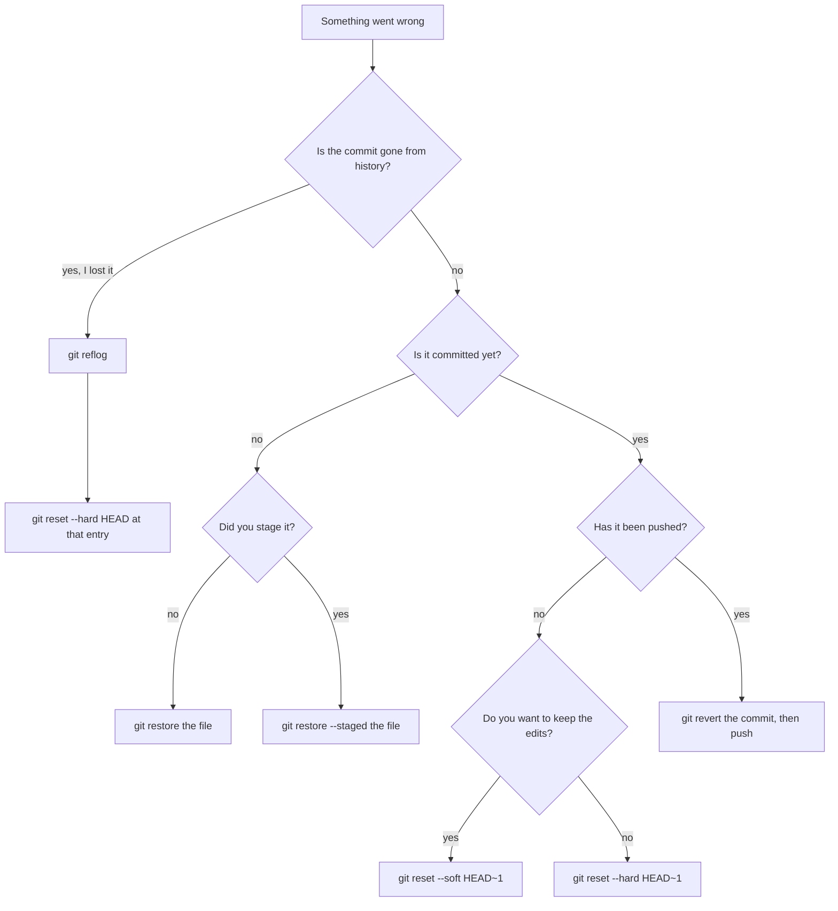

> **Section 16 · Lesson 1** · Level: beginner · ~10 min · Prereq: [Git essentials](05-Git-Essentials)

## Why this matters

Git ships around a hundred and fifty commands and you will use about twelve. This page is those twelve, grouped by what you are trying to do, followed by the recovery commands you reach for when an agent has just rewritten four files you did not mean to touch. Read it once, then search it instead of guessing.

## Set up once per machine

```bash
git config --global user.name "Your Name"        # identify your commits
git config --global user.email you@example.com   # use the address on your GitHub account
git config --global init.defaultBranch main      # new repos start on main
git config --global pull.rebase false            # pull merges instead of rewriting commits
git config --list --show-origin                  # every setting, and which file set it
```

`git config --list` can print credential-helper settings. Read it on your own machine; never paste the output into an issue, a chat, or an agent session.

## Every day

```bash
git status                     # first command before and after any agent edit
git diff                       # read unstaged edits line by line
git diff --staged              # read exactly what is about to be committed
git add -p                     # stage one hunk at a time, not one `git add -A` sweep
git add path/to/file.py        # stage a single file
git commit -m "why, not what"  # save a checkpoint; small and often beats one big commit
git log --oneline -10          # confirm your last few commits say what you think
git switch -c feat/add-health-endpoint   # branch so main stays deployable
git push -u origin feat/add-health-endpoint   # publish; -u makes later pushes just `git push`
```

## Branches

```bash
git branch                  # list local branches, and which one you are on
git switch main             # move to an existing branch (prefer switch over checkout)
git merge main              # bring main into your feature branch
git branch -d feat/done     # delete a branch after its pull request merges
git cherry-pick <sha>       # copy one commit from another branch, and nothing else
```

## Undo: what each command preserves

The difference between these is only ever *what survives*.

| Command | What it preserves |
| --- | --- |
| `git restore <path>` | Nothing. Discards uncommitted edits; work never added has no reflog entry. |
| `git restore --staged <path>` | Your edits, in the working tree. Only the staging decision is undone. |
| `git restore --source=HEAD~1 -- <path>` | The file at an older commit, restored into the working tree while history stays untouched. |
| `git commit --amend --no-edit` | Rewrites the last commit in place. Safe only while it is unpushed. |
| `git revert <sha>` | Everything else: adds an undo commit, so history is appended rather than rewritten. |
| `git reset --soft HEAD~1` | Uncommits the last commit and leaves its changes staged. |
| `git reset HEAD~1` | Uncommits and unstages, but keeps the changes on disk. This is the default mode. |
| `git reset --hard HEAD~1` | Nothing. Deletes the commit and the changes; only the reflog can help, and only briefly. |
| `git reflog` | The list of everywhere `HEAD` has pointed — the way back after a bad reset or rebase. |

Worth memorising: `--soft` keeps work staged, plain `HEAD~1` keeps it unstaged, `--hard` keeps nothing.

## Inspecting before you blame

```bash
git diff --stat                            # file-level summary when a diff is too large to read
git diff main...HEAD                       # everything your branch adds — the reviewer's view
git log --oneline --graph --decorate --all # one-screen map of branches and merges
git log -S "duplicate_charge_guard"        # find the commit that added or removed a string
git log -p -- path/to/file.py              # one file's history with patches attached
git show <sha>                             # one commit: message, diff, metadata
git blame -L 20,40 path/to/file.py         # the commit that last changed those lines
git bisect start                           # binary search for the breaking commit
git bisect bad                             # mark the current commit as broken
git bisect good <old-sha>                  # mark a known-good commit
git bisect run pytest tests/test_x.py      # let bisect test each candidate for you
git bisect reset                           # end the search, back to your branch
```

`git blame` names the commit that last touched a line, not the person at fault — often whoever reformatted the file.

## Remotes and stashing

```bash
git remote -v                               # check which URL origin actually points at
git fetch --prune                           # refresh remote state, drop stale branch refs
git pull                                    # fetch and merge, when your branch is clean
git stash push -m "wip before agent run"    # park uncommitted work so you can pull or switch
git stash list                              # see what is parked
git stash apply                             # reapply and keep the stash entry (safer)
git stash pop                               # reapply and drop the entry
git clean -n                                # dry run: list what a cleanup would delete
git clean -fd                               # delete untracked files and dirs — nothing here is recoverable
```

Commit before you stash when you can; a stash is easy to forget and easy to drop.

## Pick the right undo



## I broke it — the six wounds

```bash
# 1. An agent rewrote files and you want them back
git status          # see the damage first
git restore .       # discard working-tree edits; untracked junk needs `git clean -n` then `git clean -fd`

# 2. You staged far more than you meant to
git restore --staged .   # rebuild the index; every edit stays on disk
git add -p               # then stage deliberately

# 3. Your last commit landed on the wrong branch
git switch -c right-branch      # the commit comes with you
git switch wrong-branch         # then, back on the wrong branch:
git reset --hard HEAD~1         # remove it there — safe, it is unpushed

# 4. A bad commit is already on a shared branch
git revert <sha>                # adds an undo commit
git push                        # everyone else's clone still matches the remote

# 5. Commits vanished after a reset or a rebase
git reflog                      # find the entry before the mistake
git reset --hard HEAD@{2}       # or: git switch -c rescue <sha>

# 6. You are stuck mid-merge or mid-rebase with conflict markers
git status                      # prints the next step
# resolve, then: git add <file> && git rebase --continue
git merge --abort               # or back out entirely
git rebase --abort
```

Wounds 4 to 6 cost the most time: reverting is the only safe undo for published history, the reflog is the only way back from a hard reset, and `git status` always says whether you are mid-merge, mid-rebase, or merely dirty.

## Never do this to a shared branch

`git push --force` rewrites commits other people already have: their next pull produces conflicts they did not cause, and open pull requests break. Rebasing or amending pushed commits does the same, because every rewritten commit gets a new identity — review comments, check runs and tags anchored to the old ones point at nothing. `git reset` on a published branch deletes history for everyone who fetches; use `git revert`. Rewriting is legitimate on a branch nobody else has checked out, and even there `git push --force-with-lease` is safer: it refuses the push if someone pushed while you were rewriting. Treat release tags as fixed — moving one makes everything keyed to it lie.

## Try it

1. In a scratch directory, `git init`, commit one file, then run `git log --oneline`.
2. Edit the file badly, run `git restore <file>`, and confirm with `git status` that nothing changed.
3. Edit it again, stage it, then `git restore --staged .` — the edit is still on disk, unstaged.
4. Commit, run `git reset --hard HEAD~1`, then recover the commit with `git reflog` and `git reset --hard HEAD@{1}`.
5. In a real repository, run `git log -S "<a function you renamed>"` and read the commit that changed it.
6. Break one test across three commits, then find the culprit with `git bisect start`, `git bisect bad`, `git bisect good <old-sha>`, `git bisect run pytest`, `git bisect reset`.

## Common mistakes

- **Treating `git restore` as an undo.** It deletes. A file you never staged has no reflog entry, so the edit is gone.
- **Using `git add -A` on a dirty tree.** It sweeps your unrelated edits into the agent's commit, so one diff holds two intentions.
- **Reaching for `git reset --hard` first.** It is the one command here that destroys work; the reflog usually rescues you, but only briefly.
- **Force-pushing to `main` after a bad merge.** It rewrites history for every clone and can erase a teammate's commit.
- **Reading `git blame` as a list of who to blame.** Read the commit and its diff before concluding anything about a person.

## Key takeaways

- Twelve commands cover most days; the rest are lookups.
- `--soft` keeps work staged, plain `HEAD~1` keeps it unstaged, `--hard` keeps nothing.
- `git revert` is the undo for anything already pushed; `git reset` is for commits only you have.
- `git reflog` is the safety net under a bad reset or rebase. Use it before you give up.
- `git status` before and after every agent edit is what makes fast editing safe.
- Never rewrite history on a shared branch; prefer `--force-with-lease` even on your own.

## Further learning

- `git help <command>` and `git <command> --help` — the offline reference, always the version you have installed.
- [Git essentials](05-Git-Essentials) — the concepts behind these commands, including the four places a change lives.
- [Keeping diffs small](03-Keeping-Diffs-Small) — the review habit that makes small commits pay off.
- [CI troubleshooting](05-CI-Troubleshooting) — what to do when the pipeline is red because of a commit.
- [GitHub docs](https://docs.github.com/) — search this root for git workflow, pull request, and history topics.
- [GitHub CLI cheat sheet](16-GitHub-CLI-Cheat-Sheet) — the same tasks through `gh` instead of raw git.
