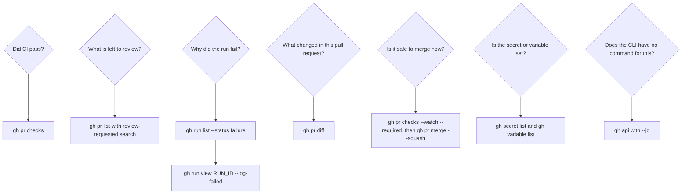

> **Section 16 · Lesson 2** · Level: beginner · ~10 min · Prereq: [GitHub CLI quickstart](05-GitHub-CLI-Quickstart)

## Why this matters

`gh` is the GitHub web UI with a memory: every issue, pull request, check run and secret is one command away, and every command has machine-readable output you can hand to a script or an agent. The value is not speed — it is that "is this safe to merge?" becomes a command that returns an exit code instead of a browser tab you have to eyeball.

## Know who you are

```bash
gh auth status                      # account and token scopes: run this when anything behaves oddly
gh auth login                       # once per machine: GitHub.com, HTTPS, then the browser
gh auth switch                      # you pushed as your personal account instead of your work one
gh auth refresh -s workflow         # a push touching .github/workflows was rejected
gh auth refresh -s project          # adding a pull request to a project board needs this scope
gh auth setup-git                   # make git use gh as its credential helper, so pushes stop prompting
gh status                           # assigned issues, review requests and your PRs on one screen
```

`gh auth token` prints your token in clear text. Do not run it in a shared terminal, a screen recording, or an agent session that logs its own commands.

## Repositories

```bash
gh repo create my-app --private --source=. --push   # turn this folder into a repo and push it
gh repo clone owner/repo                            # clone without remembering the URL
gh repo fork owner/repo --clone                     # contribute: create the fork and clone it
gh repo view --web                                  # open the current repo in the browser
gh repo list owner                                  # find the name you half-remember
gh pr list -R owner/repo                            # -R acts on another repo without cloning it
```

## Issues

```bash
gh issue create --title "..." --body "..."          # file the bug while the steps are fresh
gh issue list --assignee @me --label bug            # what is on my plate right now
gh issue view 42 --comments                         # read the discussion, not just the description
gh issue comment 42 --body "..."                    # add evidence without opening a browser
gh issue close 42 --comment "fixed in #99"          # close with a reason that links the change
gh issue develop 42 --checkout                      # branch linked to the issue, ready to work
```

## Pull requests

```bash
gh pr create --base main --fill                     # title and body from the branch's commit messages
gh pr create --draft --body-file pr.md              # not ready yet, using your PR template
gh pr list --search "review-requested:@me"          # the precise answer to "what is left to review"
gh pr view 42 --web                                 # full rendered context
gh pr diff 42                                       # the raw diff, including what the UI collapses
gh pr checkout 42                                   # run a colleague's branch locally
gh pr review 42 --approve                           # approve after reading the diff
gh pr review 42 --request-changes --body "..."      # block with a specific reason
gh pr comment 42 --body "..."                       # report a finding without changing review state
gh pr checks 42 --watch --required                  # wait for the checks that actually gate the merge
gh pr merge 42 --squash --delete-branch             # merge and clean up
gh pr merge 42 --auto                               # merge only once checks and approvals pass
gh pr status                                        # your PRs and their review state, one screen
```

## Checks, runs and workflows

```bash
gh run list --limit 5                               # what ran recently, and how it ended
gh run list --status failure --limit 5              # start here when something is red
gh run list -w deploy.yml -b main                   # narrow to one workflow on one branch
gh run view <run-id>                                # per-job, per-step summary first, logs second
gh run view <run-id> --log-failed                   # logs from the failed steps only: fastest route to the error
gh run view <run-id> --json jobs --jq '.jobs[] | {name, databaseId}'   # the real job IDs for --job
gh run watch <run-id> --exit-status --compact       # follow live, exit non-zero on failure
gh run rerun <run-id> --failed                      # retry failed jobs after an infrastructure flake
gh run cancel <run-id>                              # stop a run you started by mistake
gh run download <run-id>                            # fetch an artifact from a finished run
gh workflow list                                    # what GitHub sees, and whether one is disabled
gh workflow run "Promote to Production" --ref main  # trigger a workflow_dispatch job
```

## Releases

```bash
gh release create v1.2.0 --generate-notes                  # notes assembled from merged PRs
gh release create v1.2.0 ./dist/app.zip#installer          # attach a file; text after # is its label
gh release list                                            # which versions exist, which is latest
gh release view v1.2.0 --json assets                       # machine-readable check of what shipped
gh release download v1.2.0                                 # fetch assets without a browser
```

## Secrets and variables

```bash
gh secret set SERVICE_API_KEY --body "$VALUE"              # read from a variable, not typed inline
gh secret set DATABASE_URL --env production                # environment secret, as a gated job expects
gh secret list --env production                            # confirm it exists (names only, never values)
gh variable set API_URL --body "https://staging.example.invalid" --env staging
gh variable list                                           # catch a staging URL set on production
gh secret delete OLD_KEY                                   # retire a rotated credential
```

Pipe a value from stdin (`gh secret set KEY --body "$VALUE"`) rather than typing it, or the secret ends up in your shell history.

## Projects

```bash
gh project list --owner @me                                # find the board number
gh project item-list 1 --owner @me --format json            # export the board for a report or script
gh project item-add 1 --owner @me --url <issue-url>         # add an issue from the terminal
```

## The escape hatch: gh api

If you can click it in the UI, there is an endpoint. `gh api` calls it with your token attached and pipes cleanly into `--jq`.

```bash
# Failing runs in the current repository
gh api repos/{owner}/{repo}/actions/runs \
  --jq '.workflow_runs[] | select(.conclusion=="failure") | .id'

# One field, for a script
gh api repos/{owner}/{repo} --jq '.default_branch'

# Every open issue number, following pagination
gh api --paginate repos/{owner}/{repo}/issues --jq '.[].number'

# Create an issue. -f sends a string field and switches the method to POST
gh api repos/{owner}/{repo}/issues \
  -f title="OpenAPI drift" -f body="The generated client is out of date."

# Raw GraphQL when REST has no shape for your question
gh api graphql -f query='query { viewer { login } }'
```

`{owner}` and `{repo}` are substituted from the current clone, so these run anywhere inside the repository. `-f` sends a string; `-F` sends a typed value (a number, a boolean, or `@file` content). Mixing them up is the usual cause of a 422.

## Flags that beginners miss

```bash
gh <command> --json a,b,c --jq '...'   # machine-readable output; --jq is built in, no jq needed
gh <command> --web                     # open the same thing in the browser
gh pr create --draft                   # keep it out of "ready for review" until it is ready
gh pr create --fill                    # title and body from this branch's commits
gh pr checks --watch --required        # wait for the checks that actually gate the merge
gh run watch <id> --exit-status        # follow a run and fail the shell if it fails
gh <command> -R owner/repo             # act on another repository without cloning it
gh api --paginate --slurp              # follow pagination, collect the pages into one array
```

`--json` with `--jq` is the pair worth learning first: it turns any command into input for a script or an agent.

## Which question maps to which command



## I broke it — runs that are red

Work in this order and you will not read ten thousand log lines.

1. **Find the run.** `gh run list --status failure --limit 5` shows recent failures with their IDs. Add `-w <workflow>` or `-b <branch>` when there are many workflows.
2. **Read the failure.** `gh run view <run-id>` gives the job and step summary; `gh run view <run-id> --log-failed` prints only the failed steps' output.
3. **Re-run what is genuinely broken.** `gh run rerun <run-id> --failed` retries failed jobs. The right move for a flake, the wrong move for a test you have not fixed.
4. **Inspect a pull request's checks.** `gh pr checks 42`, then `--required` to see only what blocks the merge, or `--json name,state,bucket --jq '.[] | select(.bucket!="pass")'` for a script-friendly list. Use `--watch` instead of polling.
5. **Remember that non-zero is not always failure.** A deploy step can exit non-zero with `Failed to retrieve build log` because the platform skipped an unchanged build and had no logs to stream. Grep the log for the skip message and treat that case as success, otherwise you hunt a bug that does not exist. Real build failures read differently: they end with a compiler or test error before your code ever starts.
6. **Wrong account or missing scope?** `gh auth status` shows both. `gh auth switch` changes account; `gh auth refresh -s workflow` adds a scope.

## Try it

1. Run `gh auth status`, then `gh status` to see what is assigned to you.
2. Pick a recent workflow run and read it three ways: `gh run view <run-id>`, then `--log-failed`, then `--json jobs --jq '.jobs[] | {name, databaseId}'`.
3. Find a run that failed last week and retry only its failed jobs.
4. In a practice repo, open a draft pull request with `gh pr create --draft --fill`, then compare `gh pr checks` with `gh pr view --web`.
5. Run `gh secret list` and `gh variable list`, and confirm every staging URL is set on staging, not production.
6. Use the escape hatch once: `gh api repos/{owner}/{repo} --jq '.default_branch'`.

## Common mistakes

- **Reading a silent `gh pr checks` as success.** With no checks configured there is nothing to report and the command looks happy. Confirm real check names before merging.
- **Re-running flaky-looking failures without reading them.** `--failed` is cheap, so it becomes a habit that hides a real failing test behind a green second attempt.
- **Using the job number from the URL with `--job`.** It looks like an ID and returns 404. Get the real one from `gh run view <run-id> --json jobs`.
- **Setting a secret inline.** `gh secret set KEY --body "value"` writes the value into your shell history.
- **Merging locally with git instead of `gh pr merge`.** That bypasses the pull request record, the required checks and the review audit trail.

## Key takeaways

- `gh auth status` first, always: most odd behaviour is the wrong account or a missing scope.
- `gh pr create` → `gh pr checks` → `gh pr merge` is the review loop in three commands.
- `gh run view <run-id> --log-failed` is the fastest path from red to root cause.
- `--json` with `--jq` turns any command into something a script or an agent can consume.
- Reach for `gh api` rather than inventing a subcommand; `-f` versus `-F` is the usual trap.
- A non-zero exit can mean "skipped", not "broken" — read the message before debugging.

## Further learning

- [Workflow syntax for GitHub Actions](https://docs.github.com/actions/using-workflows/workflow-syntax-for-github-actions) — what the checks you are watching are defined by.
- [Secure use reference](https://docs.github.com/en/actions/reference/security/secure-use) — token scopes and least privilege for automation.
- [GitHub Actions documentation](https://docs.github.com/en/actions) — the docs root for runs, artifacts and caches.
- [Secrets in CI](05-Secrets-In-CI) — how secrets reach a workflow, and how to keep them out of logs.
- [CI troubleshooting](05-CI-Troubleshooting) — the wider playbook when a pipeline is red.
- [Git cheat sheet](16-Git-Cheat-Sheet) — the git half of the same workflow.
