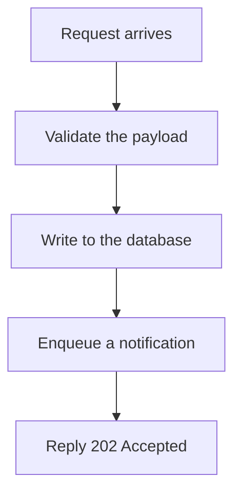
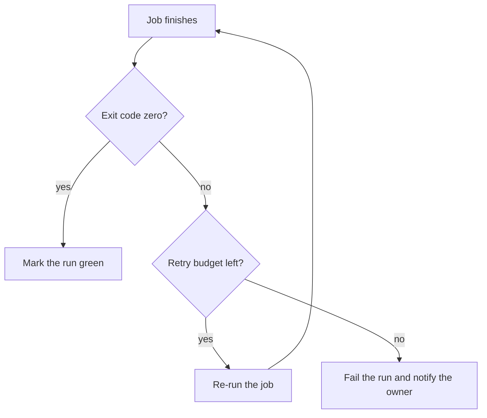
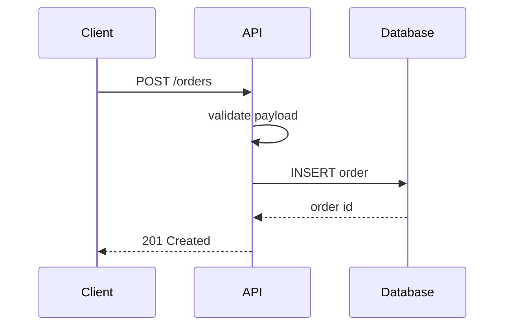
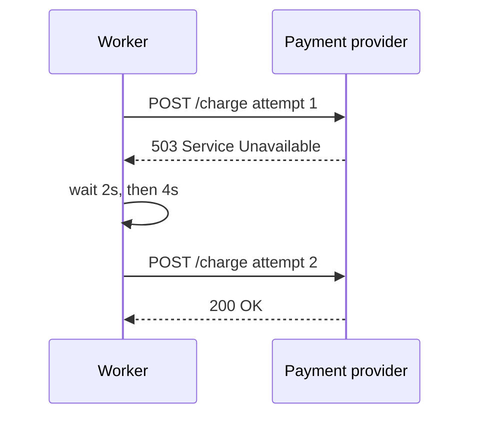
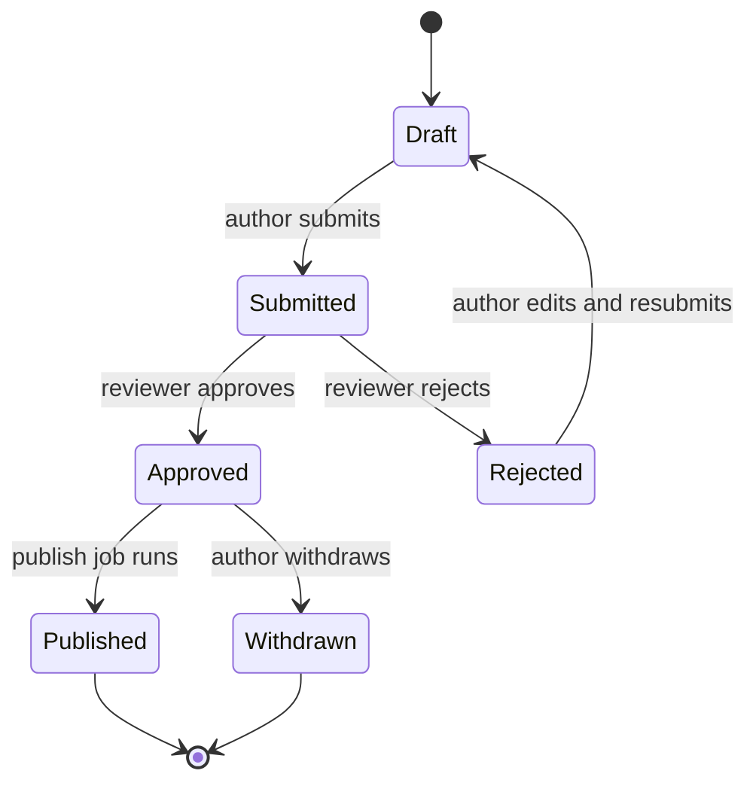
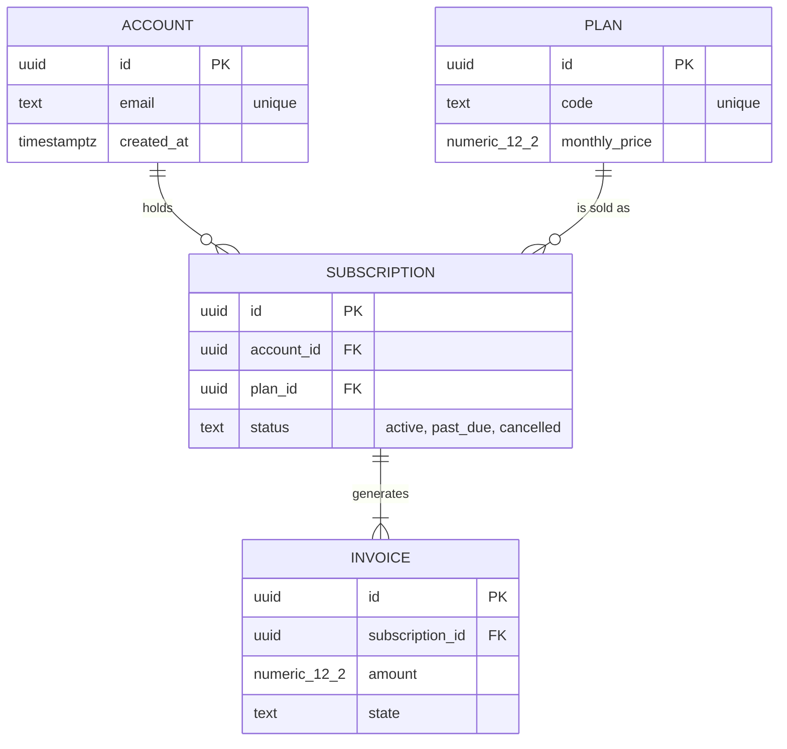
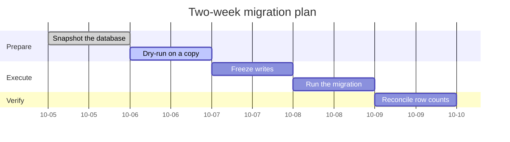
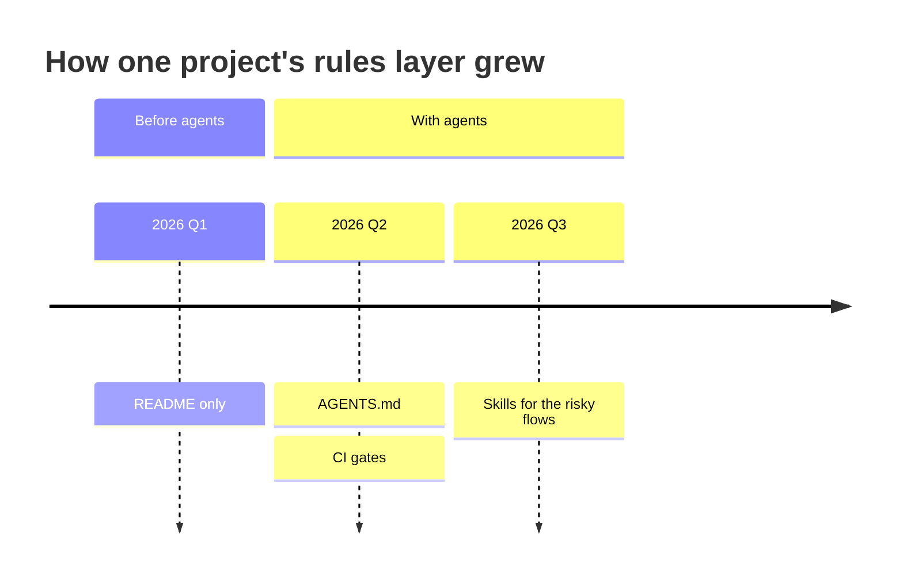
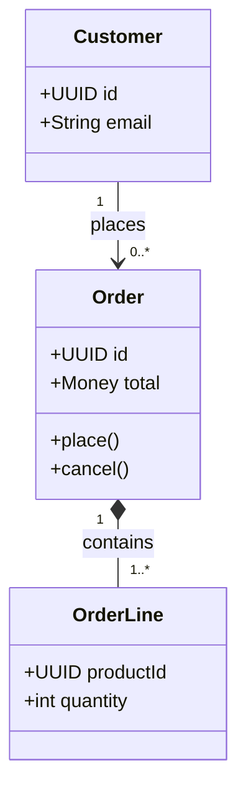

> **Section 16 · Lesson 4** · Level: beginner · ~15 min · Prereq: [Diagrams as code](06-Diagrams-As-Code)

## Why this matters

You do not need to remember Mermaid syntax. You need the right snippet at the moment you are writing a pull request, and the judgement to pick the type that answers the question in front of you. This page is that shelf: every template below is short enough to paste unchanged and annotated enough to adapt in one edit.

Keep it open beside [Diagrams as code](06-Diagrams-As-Code). That lesson argues why diagrams belong in the repository; this one is the copy-paste half.

## Rules that stop the parser complaining

Mermaid is text, so a missing quote or a stray bracket shows up as an error box in the pull request instead of a picture. Four habits prevent almost every failure:

1. **Quote any label with punctuation or spaces.** `A["Verify (twice)"]` renders; the unquoted form may not. Quoting a plain label is always legal, so quote by default.
2. **Keep node ids boring.** Letters, digits and underscores only — no spaces, no colons, and never `end`, which closes a block. The id is for the parser; the quoted label is for the reader.
3. **One idea, twenty nodes, one screen.** A diagram that needs scrolling is a diagram nobody updates. When it sprawls, split it into two pictures with one shared box.
4. **Match the type to the job.** `flowchart` for process and structure, `sequenceDiagram` for interactions, `stateDiagram-v2` for lifecycles, `erDiagram` for schemas, `classDiagram` for types, `gantt` for plans, `timeline` for history.

GitHub renders fenced `mermaid` blocks. It ignores what other renderers accept: `%%{init}%%` theme directives, `click` handlers, and HTML or emoji inside labels. Leave them out of anything that has to render.

## Process and decisions: flowchart

The process template reads top to bottom. Swap the labels; leave the direction alone.

A decision adds one diamond per branch. Two exits per diamond, labelled — never a silent unlabelled exit.

## Interactions: sequenceDiagram

The request template is the plainest possible happy path. Add the failure arrow before you ship the diagram, not after.

Retries need the wait between attempts and the outcome of each one, or the picture teaches nothing.

## Lifecycles: stateDiagram-v2

States are the nouns that survive a restart; labelled arrows are the events that move them.

## Schemas: erDiagram

Read the arrows as sentences: an account holds zero or more subscriptions, and every subscription generates one or more invoices.

## Plans and history: gantt and timeline

A `gantt` is for a dated plan with dependencies; keep the tasks coarse, because a bar chart of twelve one-day items is a calendar, not a plan.

A `timeline` is for things that already happened, grouped by era rather than by date.

## Types: classDiagram

Use this for the shapes your code passes around, not for every method you own. Multiplicity tells the reader what a collection is allowed to contain.

## The three diagrams every project should have first

1. **Context.** A `flowchart` of your system as a single box, with its users and the outside services it calls. Five boxes, in the README, so a new reader learns the shape in ten seconds.
2. **Data flow with the trust boundary labelled.** Where a request's data enters, what it touches, where it is stored, and the line past which input stops being trusted. Most security incidents sit on the wrong side of an unlabelled line.
3. **The state machine of your riskiest flow.** Payments, publishing, provisioning, anything a restart must not corrupt. Draw it before you write the code and attach it to the same pull request.

Everything else is optional until someone asks a question the three cannot answer.

## Try it

1. Create `docs/diagrams/` and paste the context template, replacing the labels with your own five boxes.
2. Paste the `erDiagram` template and change it to your three most important tables. Mark keys and one constraint per table.
3. Draw the state machine for your riskiest flow, then ask the agent: "Read `docs/diagrams/orders.md` and list every state transition in the code that is missing from it."
4. Break a diagram on purpose — delete a closing quote — and see what GitHub shows. Then fix it.
5. Commit the diagrams in the same branch as the feature they describe.

## Common mistakes

- **Unquoted labels with punctuation.** `A[Verify (twice)]` can break the parser. Quote every label; it costs two characters.
- **One diagram that does everything.** Twenty boxes with four kinds of arrow is unreadable, and it will be stale within a week.
- **Cargo-culted directives from a blog post.** `%%{init}%%` and `click` are dropped by GitHub's renderer, so the diagram looks broken for no visible reason.
- **A sequence diagram with only the happy path.** If every arrow succeeds, the diagram hides the retry and duplicate-callback cases that cause the incidents.
- **Using `end` as a node id.** It closes a block, and the error message will not point at the line you wrote.
- **A `gantt` chart as project management theatre.** A Gantt of forty tasks is never updated. Keep the bars coarse or use prose.

## Key takeaways

- Quote every label; keep node ids to letters, digits and underscores; never use `end` as an id.
- One idea per diagram, twenty nodes maximum, split rather than sprawl.
- Pick the type by the question: flowchart for process, sequence for interaction, state for lifecycle, erDiagram for schema, classDiagram for types, gantt for plans, timeline for history.
- Draw the three starter diagrams first: context, data flow with the trust boundary, and the state machine of your riskiest flow.
- Paste, then delete half. A template you did not trim is a diagram that does not describe your system.

## Further learning

- [Diagrams as code](06-Diagrams-As-Code) — C4 levels, diagram hygiene, and why text beats a screenshot.
- [State machines for real features](06-State-Machines-For-Features) — turning the lifecycle template into guards, tests and idempotent transitions.
- [Data modeling basics](06-Data-Modeling-Basics) — how to read your `erDiagram` against the schema that actually shipped.
- [GitHub Docs](https://docs.github.com/) — search "mermaid" for what the built-in renderer supports and silently drops.
- [Templates](16-Templates) — the ADRs, SOPs and runbooks these diagrams belong beside.
