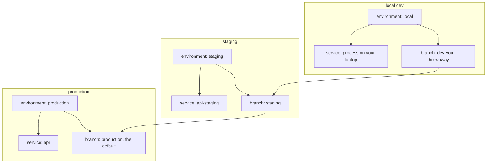

> **Section 16 · Lesson 3** · Level: intermediate · ~12 min · Prereq: [Deploy on Railway](07-Deploy-On-Railway)

## Why this matters

Railway runs your code; Neon holds your data. Neither is hard on its own, and both are easy to point at the wrong place. Here are the commands, plus the habit that prevents the expensive mistakes: knowing which environment and which branch your next command touches *before* you run it.

> **Before any write command:** run the status check for the tool you are about to use and say out loud which environment and branch you expect. If you cannot, stop. `railway status` shows the linked environment; `neonctl branches list` shows every branch you could hit.

## Railway

A **project** holds **services** (each one deployable thing) and **environments** (isolated sets of services and variables, such as `staging` and `production`).

```bash
railway login                                             # authenticate once
railway whoami                                            # which account am I acting as
railway link -p <your-project> -e staging -s <your-service>   # bind this directory; linking is per directory
railway status                                            # linked project, environment, service
railway list                                              # every project, when you forgot the name
railway service list                                      # services in the current environment
railway service status                                    # deployment status per service, at a glance
railway environment list                                  # environments; --ephemeral shows PR environments
railway environment new pr-123 --copy staging             # one environment per pull request
```

```bash
railway up                                                # upload and deploy, streaming build + deploy logs
railway up -d                                             # detached: return now, read logs later
railway up --ci                                           # build logs only, exits when the build ends
railway up --service <your-service> --environment staging # be explicit when a project has several services
railway up --project <your-project> --environment production  # --environment is required with --project
railway redeploy --service <your-service>                 # rebuild the same code, e.g. after a variable change
railway redeploy --from-source                            # pull the latest commit first
railway down --service <your-service>                     # remove the most recent deployment
```

```bash
railway logs --service <your-service>                     # runtime logs
railway logs --service <your-service> -b                  # build logs: build failure and start failure differ
railway deployment list --service <your-service>          # recent deployments, IDs, and SKIPPED ones
railway variable list --service <your-service> --json     # contains passwords — never paste the output
railway variable set KEY=value --service <your-service> --skip-deploys   # change a variable, no restart
railway variable delete KEY --service <your-service>      # retire a rotated credential
railway run <command>                                     # run locally with the linked env's variables injected
railway connect <database-service>                        # psql into a Railway-hosted Postgres over a tunnel
railway usage                                             # usage and limits, when a bill looks wrong
```

In CI, replace the interactive login with a project token: `RAILWAY_TOKEN=${{ secrets.RAILWAY_TOKEN }} railway up --ci --service <your-service>`. Project tokens are scoped to one environment and can only deploy, redeploy and read logs. `railway run` deserves respect: it injects the linked environment's variables into a local command, which is the easiest way to migrate production by accident.

## Neon

```bash
npx neon@latest init                                  # one-command setup; links a project, writes DATABASE_URL to .env
neonctl auth                                          # authenticate the CLI
neonctl projects list                                 # project IDs; confirm you are pointed at the right one
neonctl link --project-id <your-project> --branch staging   # pin project + branch to this directory
neonctl checkout <branch>                             # change the pin; every later command uses it
neonctl branches list                                 # every branch, and which is the default
neonctl branches create --name staging --parent production   # copy-on-write clone with realistic data
neonctl branches set-expiration <branch> --expires-at 2026-12-31T23:59:59Z   # PR branches clean themselves up
neonctl branches reset <branch> --parent              # throw away a non-production branch's changes
neonctl branches restore <target> <source>@<timestamp>   # point a branch at an earlier moment
neonctl branches schema-diff production staging       # compare two branches before migrating
neonctl snapshots create --branch production --name before-0007-add-status   # a named restore point
neonctl snapshots list                                # and: neonctl snapshots restore <id>
neonctl connection-string staging                     # direct endpoint: migrations and admin work
neonctl connection-string staging --pooled            # pooled endpoint: application traffic
neonctl psql staging                                  # open psql against that branch
neonctl databases list                                # and: roles list, operations list, logs, api
```

The pooled string carries `-pooler` in its hostname. Direct endpoints can be IPv6-only, so a network with no IPv6 route gives `ENETUNREACH`; use the pooled endpoint there.

## Migrations against a branch

```bash
neonctl branches list                                        # 1. which branch am I about to change?
export DATABASE_URL="$(neonctl connection-string staging)"    # 2. direct string, never the pooler
psql "$DATABASE_URL" -c "select current_database(), now()"   # 3. prove the target before writing
python -m app.migrate                                        # 4. your runner; keep the string out of logs

# The rules that make migrations boring
# - schema before code: a route touching a missing column returns 500s on every request
# - idempotent: ADD COLUMN IF NOT EXISTS, CREATE TABLE IF NOT EXISTS, CREATE INDEX IF NOT EXISTS
# - schema only: seed data belongs in a script pointed at the staging branch
# - a runner that splits a .sql file on ';' mangles dollar-quoted blocks (DO $$ ... $$),
#   so write constraint changes without a DO block or use a real migration tool
```

Rehearse on a branch of production, not a local database with three rows in it.

## The environment matrix

Write this table for your project and keep it in the repository.


| Environment | Railway service / environment | Neon branch | Who may write |
| --- | --- | --- | --- |
| Local dev | your process on your laptop | `dev-<you>`, throwaway | you |
| Staging | `api-staging` in environment `staging` | `staging` | CI, on merge to `main` |
| Production | `api` in environment `production` | `production`, the default branch | a gated promotion, human-approved |



Each Railway environment carries its own `DATABASE_URL`, and CI holds one secret per environment (`DATABASE_URL_STAGING`, `DATABASE_URL_PRODUCTION`). The pairing rule is absolute: the service in environment X reads the string whose branch is X's database. If a staging service's `DATABASE_URL` names the production branch, staging writes to production and nothing in the UI warns you. Branching is what makes the pairing safe — a delete on `staging` cannot reach `production`, because only changed pages get duplicated.

## Safety habits before any write

- **Check the link, then write.** `railway status` prints the environment this directory is bound to. A stale link is the usual reason a deploy lands somewhere unexpected.
- **Check the pin, then write.** `neonctl checkout` persists: if your last session pinned `production`, a bare `neonctl psql` opens production.
- **Prove the target with one query.** `select current_database()` against the string you are about to use costs nothing.
- **Never write to production from a laptop.** Production migrations belong in the gated promotion path, after staging verified the change.
- **Snapshot before risky work.** `neonctl snapshots create --branch production --name before-0007` is cheap; having no restore point mid-incident is not.
- **Restore sideways.** Restore into a new branch, verify, then repoint. Restoring over a live branch extends the outage you were fixing.
- **One deploy path per service.** A repo trigger plus a pipeline `railway up` deploys twice, and the autodeploy can race your migration step.

## Try it

1. Create a throwaway project, `railway link` it, confirm with `railway status`.
2. Deploy a server with a `/health` route (`railway up --ci`), then read `railway logs`.
3. Set a variable with `--skip-deploys` and confirm the logs show no restart.
4. Create `staging`, then compare `neonctl connection-string staging` with its `--pooled` form.
5. Run `CREATE TABLE IF NOT EXISTS demo (id int)` twice against `staging`; the second run must succeed.
6. Snapshot the default branch, list snapshots, then write your environment matrix into `docs/environments.md`.

## Common mistakes

- **Deploying to a linked environment you forgot about.** The link is per directory and survives closed terminals.
- **Changing a variable without `--skip-deploys`.** One edit restarts the service mid-rollout.
- **Using the pooled string for migrations.** Pooling multiplexes short-lived clients; admin work belongs on the direct endpoint.
- **Migrating production without rehearsing on a branch.** Meet the `NOT NULL` column existing rows cannot satisfy before your users do.
- **Non-idempotent migrations.** `ADD COLUMN` without `IF NOT EXISTS` fails the second time and hides the real error behind a duplicate-column message.
- **Treating a skipped deploy as a failure.** Unchanged code yields a SKIPPED deployment, no build logs, and a non-zero CLI exit. Read the message first.
- **Printing variables into a chat or ticket.** The `--json` variable list includes credentials; share the hostname.

## Key takeaways

- Project > service > environment on Railway; project > branch on Neon. Say which one you mean every time.
- `railway status` and `neonctl branches list` are the two commands that stop wrong-target writes.
- Direct endpoint for migrations, pooled endpoint for app traffic, one `select current_database()` to prove it.
- Migrate before the code that needs the schema, idempotently, and rehearse on a branch first.
- Snapshot before risky work; restore into a new branch rather than over a live one.
- One deploy path per service; production changes only through the gated promotion.

## Further learning

- [Deploying with the CLI](https://docs.railway.com/cli/deploying) — deploy modes, project tokens, redeploy and PR environments.
- [Railway CLI reference](https://docs.railway.com/cli) and [deploying with the CLI](https://docs.railway.com/cli/deploying) — every command, plus deploy modes and project tokens.
- [Railway docs](https://docs.railway.com/) — the root to search for environments, services and variables.
- [Neon documentation](https://neon.com/docs/introduction) — branching, pooling, snapshots, restore and current limits.
- [Deploy on Railway](07-Deploy-On-Railway) and [Postgres on Neon](07-Postgres-On-Neon) — the lessons behind this sheet.
- [Environments and promotion](07-Environments-And-Promotion) and [Rollbacks and incidents](07-Rollbacks-And-Incidents) — the process around these commands.
