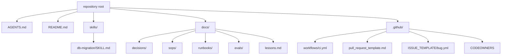

> **Section 16 · Lesson 5** · Level: intermediate · ~15 min · Prereq: [Skills as operating rules](12-Skills-As-Operating-Rules)

## Why this matters

Every lesson here asks you to write one document: a rules file, an ADR, an SOP, a skill, a runbook, an eval set. Starting from a blank page is where the habit dies, so this page is the shelf of starting points: copy the file, keep the lines that matter, delete the sample.

Each template fits a small project: one repository, one or two agents, one reviewer. Nothing here invents an action name, a CLI flag or a vendor feature — if a file needs more, read the linked lesson.

## Where each file lives

Agents find files by convention and by path, so placement is part of the template: rules at the root, GitHub files under `.github/`, human documents under `docs/`.



The rules stack these files form is worth seeing once before you write any of them:


## 1. AGENTS.md

The always-on file. Seven sections, under a page and a half.

```markdown
# AGENTS.md

## Project
One line on what this is and what it is built with.

## Architecture map
- `src/` — application code
- `db/migrations/` — one numbered file per schema change
- `docs/decisions/` — read before proposing a design change

## Commands
- Test:    `pytest -q`
- Lint:    `ruff check .`
- Migrate: `python -m app.migrate`

## Conventions
- The wire format is camelCase; the database is snake_case. Do not "fix" it.

## Gotchas
- Placeholder order must match the values array, or the query returns zero rows. (2026-09-02)

## Definition of done
Tests pass, formatter clean, migration idempotent, changelog line added.

## Docs
- `docs/decisions/` — why the design is what it is
- `docs/sops/` — runbooks for deploys and restores
```

**Keep:** real commands, conventions that differ from language defaults, dated gotchas. **Delete:** anything the agent can derive from the code. See [AGENTS.md that actually works](12-AGENTS-md-That-Works).

## 2. ADR (MADR-shaped)

One numbered file per decision, next to the code.

```markdown
# 0012 — Store uploads in object storage, not the database

- **Status**: accepted
- **Date**: 2026-10-07

## Context
Uploads are growing faster than the database's disk budget allows.

## Decision
Files go to object storage; the database keeps the key and the metadata.

## Options considered
1. Blobs in Postgres — rejected: backups grow without bound.
2. Object storage with keys in Postgres — chosen.

## Consequences
- Backups stay small and fast.
- Cost: one more service to configure in every environment.
```

**Keep:** rejected options and the stated cost. **Delete:** nothing real; never edit an accepted ADR — supersede it. See [ADRs in practice](12-ADRs-In-Practice).

## 3. SOP

For anything you do more than twice, or once if it is risky.

```markdown
# SOP: Promote a release to production

- Owner: <name or role> · Review: 2027-01-07 · Tested on: 2026-10-07

## Trigger
A release is approved for production.

## Prerequisites
- The CI run for the release commit is green.
- Rollback point exists: tag `release-<previous>` and a Neon restore point.

## Steps
1. Run `pytest -q` on the release branch. Expect `N passed`.
2. Deploy the API. Expect `{"status":"ok"}` from `/health`.
3. Run migrations. Expect one `applied` line per pending file.

## Verification
The smoke test hits `/health` and one read endpoint, both green.

## Rollback
Redeploy `release-<previous>`, then confirm `/health`. Schema rollback: restore the
Neon restore point only if a migration changed data.

## Escalation
<name or role> — send what you ran and what you saw.
```

**Keep:** the rollback point and the expected output per step. **Delete:** any step you have not executed — mark it unverified. See [Writing SOPs](12-Writing-SOPs).

## 4. Pull request template

````markdown
## What changed

## Why
Closes #

## How I verified it

```
$ pytest -q
12 passed
```

## Risk and rollback
Risk: <what breaks if this is wrong>. Rollback: <the reverse change>.

## Checklist
- [ ] Tests pass locally with the same commands CI runs
- [ ] No secrets, keys or customer data in the diff
- [ ] Rules file or ADR updated if this changes a decision
- [ ] Diagram updated if this changes a flow

<!-- Delete any prompt below that does not apply. -->
````

**Keep:** the verification block — a reviewer reads commands and output, not adjectives. **Delete:** checklist items your CI already enforces.

## 5. Issue forms

YAML forms under `.github/ISSUE_TEMPLATE/`, so a bug report arrives with the fields you need.

```yaml
# .github/ISSUE_TEMPLATE/bug.yml
name: Bug report
description: Something is broken
title: "[bug]: "
labels: ["bug", "triage"]
body:
  - type: markdown
    attributes:
      value: "Do not paste secrets, tokens or customer data."
  - type: textarea
    id: what-happened
    attributes:
      label: What happened
      description: The exact command and the output you saw.
    validations:
      required: true
  - type: input
    id: version
    attributes:
      label: Version or commit
    validations:
      required: true
  - type: dropdown
    id: environment
    attributes:
      label: Environment
      options:
        - local
        - staging
        - production
    validations:
      required: true
  - type: checkboxes
    id: confirmed
    attributes:
      label: Before submitting
      options:
        - label: I ran `pytest -q` and pasted the failure
          required: true
```

The feature and task forms reuse that shape with different bodies:

- **`feature.yml`** — one `textarea` for the problem, one for the proposed behaviour, one for what is out of scope.
- **`task.yml`** — an `input` for the deliverable and a `dropdown` for size.

**Keep:** the secrets warning and the required fields. **Delete:** fields a reporter cannot answer — an abandoned form is worse than free text. See [Issue-driven development](13-Issue-Driven-Development).

## 6. CI workflow, Python and Node

Save as `.github/workflows/ci.yml`. Both versions use only `actions/checkout`, `actions/setup-python` or `actions/setup-node`, and `actions/cache`.

```yaml
name: CI
on:
  pull_request:
    branches: [main]
permissions:
  contents: read
jobs:
  test:
    runs-on: ubuntu-latest
    timeout-minutes: 15
    steps:
      - uses: actions/checkout@v4
      - uses: actions/setup-python@v5
        with:
          python-version: "3.12"
      - uses: actions/cache@v4
        with:
          path: ~/.cache/pip
          key: pip-${{ runner.os }}-${{ hashFiles('requirements.txt') }}
      - run: pip install -r requirements.txt
      - run: ruff check .
      - run: pytest -q
```

```yaml
name: CI
on:
  pull_request:
    branches: [main]
permissions:
  contents: read
jobs:
  test:
    runs-on: ubuntu-latest
    timeout-minutes: 15
    steps:
      - uses: actions/checkout@v4
      - uses: actions/setup-node@v4
        with:
          node-version: "20"
      - uses: actions/cache@v4
        with:
          path: ~/.npm
          key: npm-${{ runner.os }}-${{ hashFiles('package-lock.json') }}
      - run: npm ci
      - run: npm run lint
      - run: npm test
```

**Keep:** `permissions: contents: read`, the lockfile cache key, the real test command. **Delete:** `|| true`, `continue-on-error: true` and unguarded pipes — each one makes the pipeline green forever. Baseline: [Your first CI pipeline](05-Your-First-CI-Pipeline).

## 7. CODEOWNERS

```markdown
# .github/CODEOWNERS — last matching pattern wins.

*                        @your-org/maintainers
/.github/workflows/      @your-org/platform
/docs/decisions/         @your-org/architects
/skills/                 @your-org/maintainers
```

**Keep:** the workflows path — CI is a credential surface. **Delete:** owners who have moved on. See [Team ownership and CODEOWNERS](13-Team-Ownership-CODEOWNERS).

## 8. SKILL.md

A skill is a folder with a `SKILL.md` whose frontmatter carries `name` and `description`. The description is what the agent sees before it decides to load the rest.

```markdown
---
name: db-migration
description: Use when changing the database schema — naming, idempotency and the rollback step. Not for query tuning.
---

# Database migrations

## Steps
1. Add `db/migrations/NNNN-<slug>.sql`; never edit an applied file.
2. Run it twice locally and confirm the second run is a no-op.

## Rules
- Schema only. Data moves are a separate, reviewed change.

## Reference
- `reference/rollback.md` — read only when a migration must be reverted.
```

**Keep:** the trigger description and the pointer to a bundled file — that is progressive disclosure. **Delete:** anything the agent can read from the migrations directory. See [Anatomy of a SKILL.md](04-Anatomy-Of-A-Skill-File).

## 9. Lesson-bank entry

Append-only, dated, one to five lines. Written in the same commit that produced the lesson.

```markdown
## 2026-10-07 — SQL placeholder order

The values array must match the positional placeholders in order; a mismatch
returns zero rows instead of raising. Confirmed by running the query with the
values reversed and seeing an empty result, not an error.

Fix: build the SQL text and the values list from the same source list.
```

**Keep:** the date, the observation, how it was confirmed. **Delete:** speculation — an unconfirmed theory gets quoted back as fact. See [Lesson banks and retros](11-Lesson-Banks-And-Retros).

## 10. Eval-set description

For any AI feature, write the set down before you tune the prompt.

```markdown
# Eval: support reply drafts

- Feature: draft replies for support tickets
- Data: 40 anonymised tickets — 30 tuning, 10 held back
- Must-pass checks
  - No invented policy, price or delivery date
  - Cites the ticket's own reference number
- Scored by: human review on a 1–5 clarity rubric
- Pass bar: 90% of must-pass checks, and no drop on the held-back 10
- Run when: the system prompt, the model, or the retrieval config changes
```

**Keep:** the held-back set and the re-run trigger. **Delete:** metrics nobody looks at. See [Evaluating AI features](10-Evaluating-AI-Features).

## 11. Runbook

Shorter and blunter than an SOP: one alert, the first thirty minutes, no history.

```markdown
# Runbook: api_p95_latency above 2s for 5 minutes

1. Check whether a release went out in the last 30 minutes.
2. Check the database connection count against its limit.
3. If latency started at a release: roll back to `release-<previous>`.
4. If it started without a release: check the slow-query log for one new query.
5. Escalate to <name or role> with the last two commands you ran and their output.

Stop: do not raise limits to make an alert quiet. Find the change first.
```

**Keep:** the branches and the explicit stop line. **Delete:** diagnosis theory. See [Rollbacks and incidents](07-Rollbacks-And-Incidents).

## 12. Security checklist

```markdown
- [ ] No secret, key or token in the repo, the rules file or a test fixture
- [ ] Every new outbound call has a timeout and a failure path
- [ ] Input from a user, a webhook or a document is validated before it is trusted
- [ ] New dependencies exist in the registry and are pinned
- [ ] CI actions used by workflows are pinned to a commit SHA
- [ ] Logs contain no tokens, personal data or full request bodies
```

**Keep:** the items specific to how this project breaks. **Delete:** generic advice — a surviving checklist has a real incident behind each line. See [Security checklists](09-Security-Checklists).

## 13. Release-notes entry

```markdown
## 1.4.0 — 2026-10-07

### Added
- Retry with backoff on provider timeouts

### Fixed
- Duplicate notification when a callback arrived twice

### Security
- Pinned CI actions to commit SHAs

### Removed
- The unused `/v1/legacy` route
```

**Keep:** one line per user-visible change, same order every release. **Delete:** internal refactors and dependency bumps. See [Versioning and release notes](12-Versioning-And-Release-Notes).

## Try it

1. Pick the two templates your project is missing most — usually `AGENTS.md` and the CI workflow.
2. Copy them, replace every sample with your own commands, then delete the lines that do not apply.
3. Commit the files with the change that needed them, not as a separate "docs" pull request.
4. Open a PR with the new template and confirm the checklist gets filled in.
5. Next time something costs you ten minutes, add a lesson-bank entry and one gotcha line to `AGENTS.md`.

## Common mistakes

- **Copying a template without deleting the sample content.** A rules file that describes another project is worse than an empty one, because the agent believes it.
- **A template nobody enforces.** An unreviewed PR template is decoration; connect the requirement to a check or drop the line.
- **Commands that are not the commands.** `npm test` when the script is `test:unit` teaches the agent to improvise. Copy the real command.
- **Frontmatter-free skills.** A `SKILL.md` without `name` and `description` is invisible to the agent's skill discovery.
- **`|| true` in a CI template.** It ships a pipeline that cannot fail, and the second copy spreads it.
- **A checklist that grows and is never pruned.** Past about ten items people tick without reading, which is the same as no checklist.

## Key takeaways

- Templates remove the blank page; their value is in the lines you delete after pasting.
- Rules at the root, GitHub files under `.github/`, human documents under `docs/`.
- Annotate the two or three lines that carry the intent, and delete the sample content immediately.
- A template that is not enforced by a check or a reviewer is decoration.
- When a mistake happens twice, fix the template or the rules file rather than the code alone.

## Further learning

- [Rules of operation: the full stack](12-Rules-Of-Operation-Overview) — how rules, SOPs, ADRs and skills fit together.
- [AGENTS.md that actually works](12-AGENTS-md-That-Works) — the seven sections and why the file must stay short.
- [Equipping agents for the real world with Agent Skills](https://www.anthropic.com/engineering/equipping-agents-for-the-real-world-with-agent-skills) — the `SKILL.md` format and progressive disclosure.
- [Secure use reference for GitHub Actions](https://docs.github.com/en/actions/reference/security/secure-use) — why `permissions:` and SHA pinning are in the workflow templates above.
- [Definition of done](10-Definition-Of-Done) — what the checklists are actually checking for.
