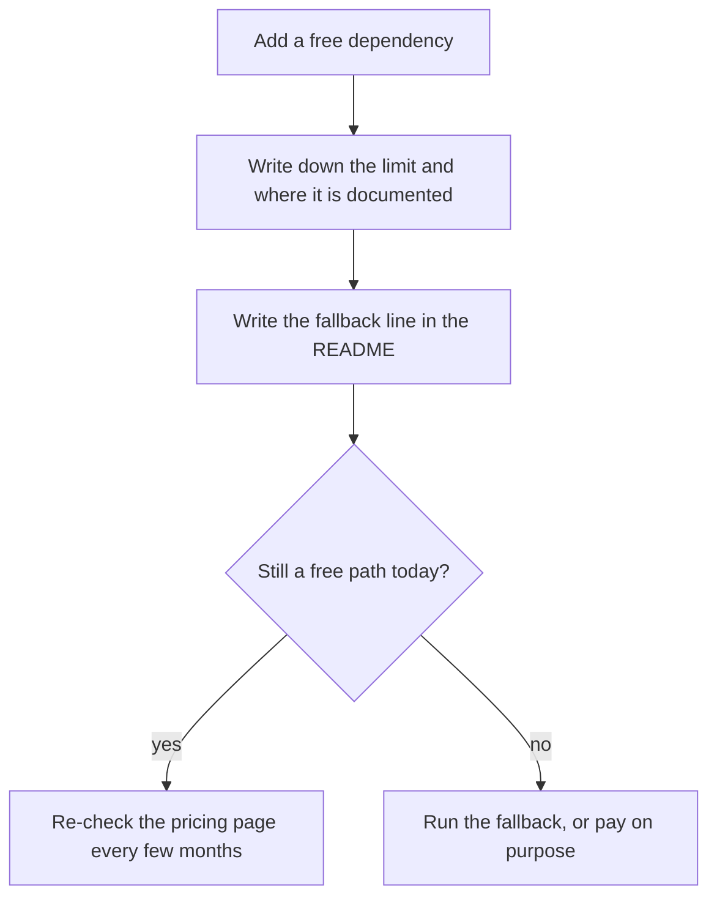

> **Section 16 · Lesson 7** · Level: beginner · ~12 min · Prereq: [Cost control for side projects](07-Cost-Control)

## Why this matters

You can build, test and ship a real project without a card on file — and you can lose a weekend to a free tier that changed shape on a Tuesday. This page is the dated list of what costs nothing right now, what each free thing prepares you for, and the one line you write in your README so that a provider's business decision never becomes your outage.

Every figure here was checked in September 2026. Free tiers are promotions, not contracts: open the provider's own pricing page before you depend on a number, and when a blog post disagrees with the provider, the provider is right. That includes this page.

## The $0 stack, verified September 2026

| What it is | What the free tier teaches / prepares you for | The catch | Where to check |
| --- | --- | --- | --- |
| **GitHub Copilot free plan** ([plans page](https://docs.github.com/en/copilot/about-github-copilot/plans-for-github-copilot)) | Editing with completions inline, then chatting about code, then letting an agent touch a file — the three modes you will use for the rest of your career | A monthly cap on completions plus a separate allowance of AI credits for chat and agent work; you get automatic model selection rather than the picker paid plans get; individuals only, not people who already have Copilot through an org | the plans page, which changes without notice |
| **GitHub Student Developer Pack** ([education.github.com/pack](https://education.github.com/pack)) | Verified students get the same tools with meaningfully larger allowances, so you can practise on real projects instead of rationing | You must verify with an education address or document, and re-verify; benefits are personal to the verified account, they change between academic years, and they stop mattering the day you graduate | the pack page, and the plans page for the student tier |
| **Free hosting for the thing you build** — [Cloudflare Workers and static assets](https://developers.cloudflare.com/workers/), [Render free instances](https://render.com/docs/free), GitHub Pages | Deploying from git, setting environment variables in a dashboard, getting HTTPS and a custom domain, reading build logs when it fails — the whole shape of shipping | Free web services sleep when idle, so the first request after a quiet morning is slow; background workers, cron and persistent disks are usually paid; bandwidth and build minutes are capped; some terms limit commercial or production traffic | each provider's free/limits doc, not its marketing page |
| **A free Postgres** ([Neon docs](https://neon.com/docs/introduction)) | A real database, real connection strings, branches you can throw away — see [Postgres on Neon](07-Postgres-On-Neon) | Databases that scale to zero mean the first query after idle pays a wake-up; storage and compute allowances are capped; look at retention and whether backups are in the free plan | the Neon docs' pricing and limits pages |
| **Free CI minutes** — [GitHub Actions](https://docs.github.com/en/actions) on public repositories | The pipeline habit: tests on every push, a status check a reviewer can trust | Public repositories get a different deal from private ones, and private ones are metered; runners are shared, so timing is noisy; a stuck job can burn the allowance while you sleep | your account's billing/usage page and the Actions docs |
| **Free local inference** — [Ollama, OpenAI-compatible API](https://docs.ollama.com/openai) | Running a model on hardware you own: no key, no quota, no request leaving the machine | Your laptop's RAM and GPU are the ceiling, quality trails the hosted frontier models, and the model file eats disk. Point it at [local models](07-Local-Models-When-Code-Cannot-Leave) instead of re-learning it here | the Ollama docs |

## The tale that proves the dated-numbers rule

Google shipped a free tier of Gemini Code Assist for individual developers. In June 2026 it was discontinued: the product documentation now covers paid and enterprise tiers, and the free individual path is gone. Nobody's code changed. A plan you could rely on for a year stopped existing between one Monday and the next.

The lesson has nothing to do with Google. A free tier is a marketing decision with a review date on it: providers keep one because it feeds a paid funnel, and retire one because it did not.

The rule is not "avoid free tiers" — the ones above are excellent. It is: never make a free tier the only path in your project. A system with one way to run has handed a vendor the switch, and they do not know it. The fix costs one line.

## What free costs in other currencies

- **Cold starts.** Free instances sleep. The first request takes seconds instead of milliseconds, which is fine until it is a demo. Let a health check wake the app before anyone is watching.
- **Quotas you must watch.** Caps are generous until they are not, and they usually arrive mid-task. [Token economics](13-Token-Economics-And-Budgets) is the same discipline applied to AI calls: measure, cap, alert.
- **Vendor lock-in on bespoke APIs.** An edge runtime, database branching, a provider's credit system: each is a real feature and each is work to move. You are choosing the exit cost, not the feature list.
- **Support gaps.** Community forum, no ticket, no SLA. Fine for a side project; name it in writing if a customer waits on it.
- **Terms that forbid commercial use.** Student and personal plans routinely restrict commercial use. Charging for something built on an education benefit can end in a suspension, so read the clause first.

The goal is not a $0 bill forever. It is to move your monthly wall — where cost begins — far enough out that you learn cheaply and pay only for the part that earned revenue.

## The fallback line

For every free thing your project depends on, write one sentence in your README:

```markdown
## Dependencies and their fallbacks
- Hosting: free tier on a managed edge host. If it turns paid or goes away,
  I will serve the static build from GitHub Pages and move the two API routes
  to a small container I already pay for.
- Database: free serverless Postgres. If it ends, I will export with
  `pg_dump` to a local file and restore into the next cheap Postgres.
- Model access: free assistant tier. If it ends, I will use local models for
  edits and pay for one hosted model by the request.
```

The wording matters less than the concrete next step it names. "If it goes away I will figure something out" is not a fallback. See [Writing for future you](11-Writing-For-Future-You) for where this belongs in the file.



## Try it

1. List every external service your project talks to: grep your code and CI config for environment variables ending in `_URL`, `_KEY` or `_TOKEN`, and write the hostnames down.
2. Open each provider's pricing or limits page. Write down the free allowance and the unit it is measured in (requests, GB-months, minutes, credits).
3. For each, write the fallback line — "if this becomes paid or turns off, I will ___" — and commit it to your README under a `Dependencies and their fallbacks` heading.
4. Circle the single most load-bearing dependency (the one whose removal stops the app, not slows it) and set a calendar reminder for 90 days out.
5. Test one fallback cheaply this week: export your data with `pg_dump`, or build your static site once and serve it from Pages. A fallback you have never run is a plan, not a fallback.

## Common mistakes

- **Treating a free tier as a contract.** It is a promotion with an unannounced end date. Plan the exit when you adopt it, while you are calm.
- **"Free" read as "no limits".** Every free tier is capped somewhere — completions, requests, minutes, storage, seats. Find the cap before it finds you.
- **Choosing on the feature list instead of the exit cost.** A bespoke API that saves a day of work and costs a week to leave is not free, it is a loan.
- **Shipping a commercial product on a student or personal plan.** The terms usually forbid it, and a verification lapse takes the product down with it.
- **Ignoring cold starts until the first demo.** Sleep-on-idle is documented on the free instance pages. Warm the service before you demo it.

## Key takeaways

- Free tiers are promotions, not contracts: never let one be your project's only path.
- A dated table is the honest format. Check the provider's page, note the date, re-check every few months.
- Write one fallback line per dependency in your README: a sentence that saves a weekend.
- Free costs you in other currencies: cold starts, quotas, lock-in, support gaps, commercial-use clauses.
- Audit your dependencies once, then test one fallback for real; an untested plan is not a plan.

## Further learning

- [Plans for GitHub Copilot](https://docs.github.com/en/copilot/about-github-copilot/plans-for-github-copilot) — the current plan list and what each free or paid tier includes.
- [GitHub Student Developer Pack](https://education.github.com/pack) — how education verification works and what it adds.
- [Gemini Code Assist documentation](https://developers.google.com/gemini-code-assist/docs/overview) — the product page where the free individual tier no longer appears.
- [Cloudflare Workers](https://developers.cloudflare.com/workers/) and [Render free instances](https://render.com/docs/free) — free hosting, and the limits that come with it.
- [Neon documentation](https://neon.com/docs/introduction) and [Postgres on Neon](07-Postgres-On-Neon) — the free database and how to use it well.
- [Ollama's OpenAI-compatible API](https://docs.ollama.com/openai) and [local models](07-Local-Models-When-Code-Cannot-Leave) — inference that no provider can switch off.
- [Cost control for side projects](07-Cost-Control), [Deploy for free](07-Deploy-For-Free) and [Choosing models](01-Choosing-Models) — the lessons behind this list.
